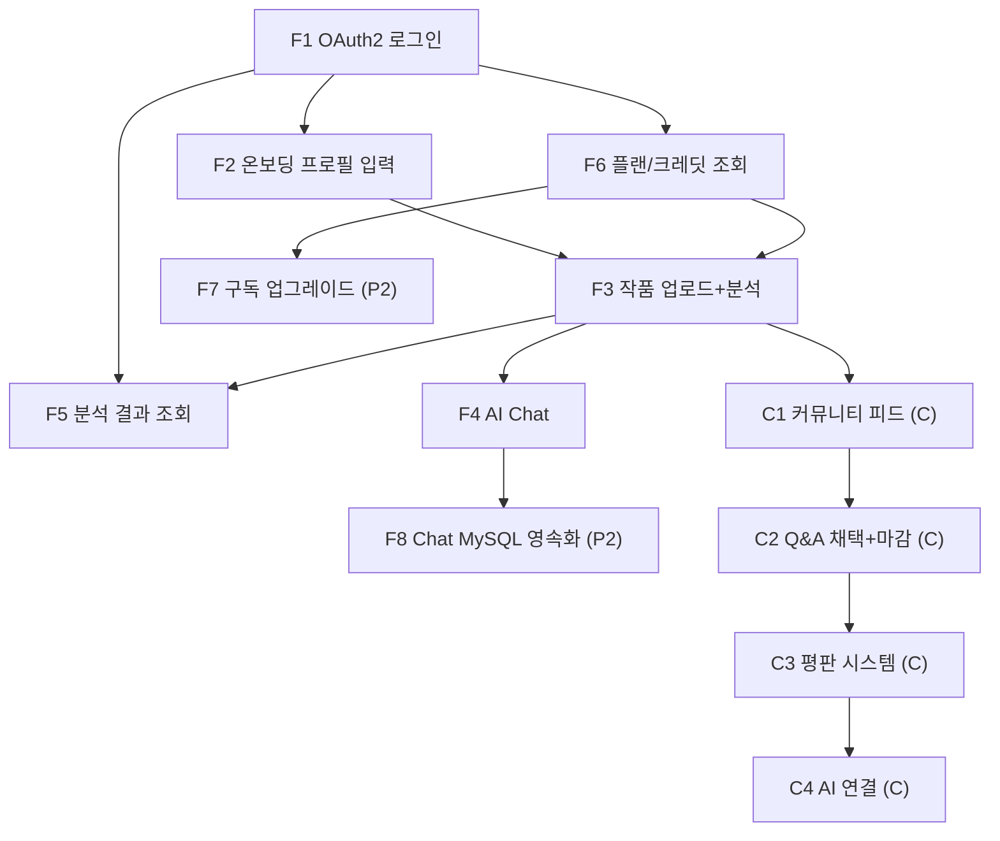

# MiriArt FSD v2.0 — 기능 명세서

> **목적**: MiriArt MVP 기능명세 (F1~F8 + Community Phase C) — Phase 구분 포함
> **버전**: 2.0 | **작성일**: 2026-02-22
> **기반**: Legacy FSD v1.3 + 확정 결정 세트 + Community Design v1.0
> **Cariv BE**: `H:\n_0221\02_21dys\BE` — 참고만, 수정 없음

---

## 1. 기능 범위 요약

| ID | 기능명 | Phase | 우선순위 | 연결 API |
|----|--------|-------|----------|---------|
| F1 | 카카오/구글 OAuth2 로그인 | **P1** | P0 | `POST /api/auth/token` |
| F2 | 온보딩 프로필 입력 | **P1** | P0 | `PATCH /api/users/me/profile` |
| F3 | 작품 업로드 + AI 분석 | **P1** | P0 | `POST /api/analyses` |
| F4 | AI Chat (Redis 세션 기반) | **P1** | P0 | `POST /api/chat` |
| F5 | 분석 결과 조회 (Archive) | **P1** | P0 | `GET /api/analyses` |
| F6 | 플랜 조회 + 크레딧 카운트 | **P1** | P1 | `GET /api/users/me/plan` |
| F7 | 구독 플랜 업그레이드 UI | **P2** | P1 | 결제 연동 미정 |
| F8 | AI Chat MySQL 영속화 | **P2** | P2 | `chat_sessions`, `chat_messages` |
| C1 | 커뮤니티 피드 CRUD | **Phase C1** | - | `GET/POST /api/posts` |
| C2 | Q&A 채택 + 마감 자동화 | **Phase C2** | - | `POST /api/posts/{id}/accept/{answerId}` |
| C3 | 평판 시스템 | **Phase C3** | - | `ApplicationEvent` |
| C4 | AI 연결 (요약/초안) | **Phase C4** | - | `/internal/ai/summarize-answers` |

---

## 2. Phase 1 기능 상세

### F1: 카카오/구글 OAuth2 로그인

**Trigger**: FE 로그인 화면에서 "카카오로 로그인" 또는 "구글로 로그인" 버튼 탭

**I-P-O-E 요약**

| 구분 | 내용 |
|------|------|
| **Input** | OAuth provider 선택 (kakao \| google) |
| **Process** | 1. FE → `GET /api/auth/{provider}/authorize` (Spring Security OAuth2 리다이렉트) → 2. 카카오/구글 로그인 → 3. `CustomOAuth2UserService.loadUser()` → 4. `User` 조회/생성 → 5. one-time code 발급 (Redis 60초) → 6. FE `/auth/callback?code={uuid}` 리다이렉트 → 7. FE `POST /api/auth/token { code }` → 8. Access + Refresh Token 발급 |
| **Output** | `{ accessToken, expiresIn, userId, needsProfile }` + `Set-Cookie: refreshToken; HttpOnly` |
| **Exception** | `AUTH001` 지원 안되는 provider / `AUTH002` 코드 만료 / `AUTH003` 이메일 동의 필요 |

**FE 처리 분기**:
```
needsProfile === true  → /onboarding
needsProfile === false → /app/home
```

---

### F2: 온보딩 프로필 입력

**Trigger**: 최초 로그인 후 `needsProfile=true` 분기로 `/onboarding` 진입

**I-P-O-E 요약**

| 구분 | 내용 |
|------|------|
| **Input** | `nickname` (2~20자), `grade` (고1/고2/고3/재수/N수), `domain` (기초디자인 등) |
| **Process** | `PATCH /api/users/me/profile` → `users.nickname/grade/domain` UPDATE + `needs_profile = false` |
| **Output** | `{ needsProfile: false, nickname }` → FE가 `/app/home`으로 이동 |
| **Exception** | `M002` 닉네임 중복 / `C001` 필드 유효성 |

**현 FE 연결**: 기존 `Signup.tsx`의 `formData` (nickname, grade, domain) → `PATCH /api/users/me/profile` 호출로 변환

---

### F3: 작품 업로드 + AI 분석

**Trigger**: Home 탭 Hero CTA 또는 FAB 탭 → Upload Flow 진입

**I-P-O-E 요약**

| 구분 | 내용 |
|------|------|
| **Input** | `image` (JPG/PNG ≤10MB), `analysisType` (basic\|major), `problemText` (선택 ≤500자) |
| **Process** | 1. 크레딧 카운트 체크 (`analysis_usage_logs` COUNT) → 한도 초과 시 `CR001` → 2. GCS 업로드 (`miriart-bucket/artworks/YYYY-MM-DD/{uuid}_{filename}`) → 3. `analyses` INSERT (`status=PENDING`) → 4. FastAPI `POST /internal/ai/analyze { gcsUri, analysisType, problemText }` WebClient 호출 → 5. Gemini Vision 분석 (~8초) → 6. `analyses` UPDATE (`status=COMPLETED`, grade/scores/fixScope/comment/universityPredictions) → 7. `analysis_usage_logs` INSERT |
| **Output** | `202 Accepted { analysisId, status: PENDING }` → FE가 `GET /api/analyses/{id}` 폴링 또는 동기 응답 |
| **Exception** | `CR001` 한도 초과 / `F001` 파일 없음 / `F002` 파일 크기 / `AN001` AI 실패 / `AN002` 타임아웃 |

**현 FE 연결**: `UploadFlow.tsx`의 `ApiService.analyze(imageFile, { type, problemText })` → `POST /api/analyses`로 경로 변경 + `Authorization` 헤더 추가

**FE 에러 처리 매핑**:
```
402(CR001) → "크레딧이 부족합니다. 플랜을 업그레이드해주세요."  (기존 유지)
408(AN002) → "분석 시간이 초과됐습니다. 잠시 후 다시 시도해주세요."  (기존 유지)
```

---

### F4: AI Chat (Phase 1: Redis 세션 기반)

**Trigger**: Chat Room 진입 → 메시지 입력 → Send

**I-P-O-E 요약**

| 구분 | 내용 |
|------|------|
| **Input** | `message`, `modelType`, `sessionId?`, `stickyContext?`, `imageBase64?`, `history?` |
| **Process** | 1. 크레딧 플랜 체크 (Basic 이상만 `IMAGE_EDIT`) → 2. Redis `miriart:chat:session:{sessionId}` 에서 컨텍스트 로드 → 3. FastAPI `POST /internal/ai/chat` WebClient 호출 → 4. Gemini 응답 수신 → 5. Redis 세션 업데이트 (TTL 72h 리셋) |
| **Output** | `{ text, quickReplies, groundingUrls, sessionId }` |
| **Exception** | `AI001` FastAPI 연결 실패 / `AI002` 타임아웃 / `CR002` 플랜 미달 |

**Phase 1 세션 데이터 구조** (Redis Value):
```json
{
  "sessionId": "sess_abc",
  "userId": "1",
  "analysisId": "ana_123",
  "modelType": "CHAT_PRO",
  "history": [
    { "role": "user", "parts": [{ "text": "밀도를 어떻게..." }] },
    { "role": "model", "parts": [{ "text": "밀도를 높이려면..." }] }
  ],
  "stickyContext": { "grade": "B", "score": 82, "fixScope": "DetailTuning" },
  "createdAt": "2026-02-22T12:00:00"
}
```

**현 FE 연결**: `ApiService.chat(params)` → `POST /api/chat` (경로 동일) + `Authorization: Bearer` 헤더 추가

---

### F5: 분석 결과 조회 (Archive)

**Trigger**: Archive 탭 진입 또는 Result Detail 화면

**I-P-O-E 요약**

| 구분 | 내용 |
|------|------|
| **Input** | JWT (본인 인증), query params (page, size, sort, grade) |
| **Process** | `GET /api/analyses` → `analyses` SELECT WHERE `user_id = ?` ORDER BY `created_at DESC` |
| **Output** | 페이지네이션 분석 목록 + `GET /api/analyses/{id}` 상세 조회 |
| **Exception** | `AUTH004` 토큰 무효 / `C005` 타인 분석 접근 |

**현 FE 연결**: `MOCK_ARTWORKS` → `GET /api/analyses` API로 교체

---

### F6: 플랜 조회 + 크레딧 카운트 체크

**Trigger**: Home 탭 Credit Status Widget, UploadFlow Step 3 크레딧 확인

**I-P-O-E 요약**

| 구분 | 내용 |
|------|------|
| **Input** | JWT |
| **Process** | `GET /api/users/me/plan` → `users.plan_type` 조회 + `analysis_usage_logs` COUNT (이번 달) → `monthly_limit - used` 계산 |
| **Output** | `{ plan, monthlyLimit, usedThisMonth, remaining, billingPeriodStart }` |
| **Exception** | `AUTH004` 토큰 무효 |

**현 FE 연결**: `useUserStore.profile.credits` (Zustand) → `GET /api/users/me/plan` 응답으로 교체

---

## 3. Phase 2 기능 상세

### F7: 구독 플랜 업그레이드 UI

**구현 예정**: Phase 2에서 결제 연동과 함께 구현.

**사전 설계**:
- FE: `SubscriptionSheet.tsx` 기존 UI 유지 → `POST /api/subscriptions/upgrade` 연동
- BE: `users.plan_type` UPDATE + `analysis_usage_logs` 리셋 로직
- 결제: 카카오페이 / 네이버페이 / 카드 (PG사 미정)

---

### F8: AI Chat MySQL 영속화 전환

**구현 예정**: Phase 2에서 Redis TTL 방식 → MySQL 영속화로 마이그레이션.

**전환 계획**:
1. `chat_sessions`, `chat_messages` 테이블 Flyway 마이그레이션 추가 (ERD_v2 §3 참조)
2. `AiChatController/AiProxyService`에 MySQL 저장 로직 추가
3. Redis는 단기 컨텍스트 캐시로만 유지 (TTL 단축)
4. FE: 채팅 히스토리 조회 `GET /api/chat/sessions` 엔드포인트 추가

---

## 4. Phase C — 커뮤니티 기능 상세

### C1: 커뮤니티 피드 CRUD

**구현 시기**: Phase C1 (2~3주)

**I-P-O-E 요약**

| 구분 | 내용 |
|------|------|
| **Input** | `type`, `title`, `content`, `imageUrls`, `tags`, `gradeScope`, `domainScope`, `isAnonymous`, `deadlineHours` |
| **Process** | `posts` INSERT + GCS 이미지 URL 저장 + `personas` 조회/생성 (익명 선택 시) |
| **Output** | 게시글 ID + FE 피드 갱신 |

**Java 도메인 패턴** (Cariv CRUD 구조 참조):
```java
// Post 상태 전이 — Cariv Order 상태 전이 패턴 참조
public enum PostStatus {
    OPEN, SOLVED, EXPIRED, CLOSED;

    public boolean canAcceptAnswer() { return this == OPEN; }
    public PostStatus accept() {
        if (!canAcceptAnswer()) throw new BusinessException(ErrorCode.CM003);
        return SOLVED;
    }
}
```

---

### C2: Q&A 채택 + 마감 자동화

**I-P-O-E 요약**

| 구분 | 내용 |
|------|------|
| **Input** | `postId`, `answerId` (질문 작성자 JWT) |
| **Process** | `post.status = SOLVED` + `answer.isAccepted = true` + `AnswerAcceptedEvent` 발행 + `post.accepted_answer_id` 업데이트 |

**마감 자동화 (배치 + 조회 fallback)**:
```java
// D2 결정: 배치 + 조회 시점 fallback
@Scheduled(cron = "0 0 * * * *")  // 매 시간
public void expireDeadlinedPosts() {
    postRepository.expireDeadlinedPosts(LocalDateTime.now());
    // UPDATE posts SET status='EXPIRED' WHERE status='OPEN' AND deadline_at < NOW()
}

// 조회 시점 fallback
public PostResponse findById(Long id) {
    Post post = postRepository.findById(id)...;
    if (post.getStatus() == PostStatus.OPEN
        && post.getDeadlineAt() != null
        && post.getDeadlineAt().isBefore(LocalDateTime.now())) {
        // 강제 EXPIRED 취급 (DB 상태 변경은 배치가 처리)
        return PostResponse.ofExpired(post);
    }
    return PostResponse.of(post);
}
```

---

### C3: 평판 시스템

**이벤트 기반 패턴** (Spring ApplicationEvent):
```java
// 채택 시 이벤트 발행
eventPublisher.publishEvent(new AnswerAcceptedEvent(answerId, answer.getAuthorId()));

// 이벤트 리스너에서 포인트 적립
@TransactionalEventListener
public void onAnswerAccepted(AnswerAcceptedEvent event) {
    reputationService.addPoints(event.getAuthorId(), 15, "answer_accepted", "answer", event.getAnswerId());
}
```

**레벨 계산** (Community Design v1.0 §4.2):
```java
public static int calculateLevel(int score) {
    if (score >= 700) return 12;
    if (score >= 300) return 8;
    if (score >= 100) return 5;
    if (score >= 30) return 3;
    return 1;
}
```

---

### C4: AI 연결 (Q&A 요약/초안)

**FE → Java BE → FastAPI 흐름**:
```
FE: [AI가 답변 요약/보충] 버튼 클릭
  → POST /api/posts/{id}/ai-summary
     → Java BE: 답변 목록 수집 + FastAPI POST /internal/ai/summarize-answers 호출
        → 응답: { summary: "3줄 요약", supplement: "추가 설명" }
  → FE: AiSummaryCard 컴포넌트 렌더링
```

---

## 5. FE 현 ApiService → 새 API 마이그레이션 매핑

| 현 FE (`gemini.ts`) | 새 엔드포인트 | 인증 | 변경 사항 |
|---------------------|-------------|------|-----------|
| `ApiService.analyze(file, options)` | `POST /api/analyses` | Bearer 필수 | 경로 변경, 헤더 추가 |
| `ApiService.chat(params)` | `POST /api/chat` | Bearer 필수 | 경로 동일, 헤더 추가 |
| `ApiService.editImage(params)` | `POST /api/chat` (modelType: IMAGE_EDIT) | Bearer 필수 | 단일 채팅 API로 통합 |

**FE `miriartApi.ts` 신규 파일로 교체** (기존 `gemini.ts` deprecate 후 삭제):
```typescript
const API_BASE = import.meta.env.VITE_API_BASE_URL || 'http://localhost:8080';

function getAuthHeader(): Record<string, string> {
  const token = localStorage.getItem('accessToken');
  return token ? { Authorization: `Bearer ${token}` } : {};
}

// 기존 ApiService.analyze → 새 함수
export async function analyzeArtwork(file: File, options: AnalyzeOptions) {
  const formData = new FormData();
  formData.append('image', file);
  formData.append('analysisType', options.type);
  if (options.problemText) formData.append('problemText', options.problemText);
  return apiFetch<AnalyzeResponse>('/api/analyses', {
    method: 'POST',
    headers: getAuthHeader(),  // Authorization 헤더 추가
    body: formData,
  });
}
```

---

## 6. 기능 의존성 그래프



---

## Document Metadata

| 항목 | 값 |
|------|-----|
| Version | 2.0 |
| Date | 2026-02-22 |
| Based on | Legacy FSD v1.3, Community Design v1.0, API_CONTRACT v1.0, ERD_v2 |
| Phase | P1 (F1~F6) / P2 (F7~F8) / C (Community) |
