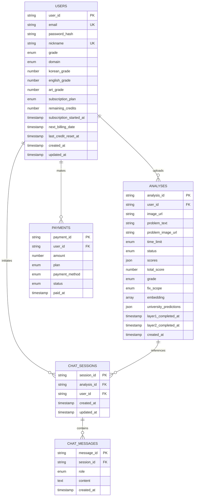
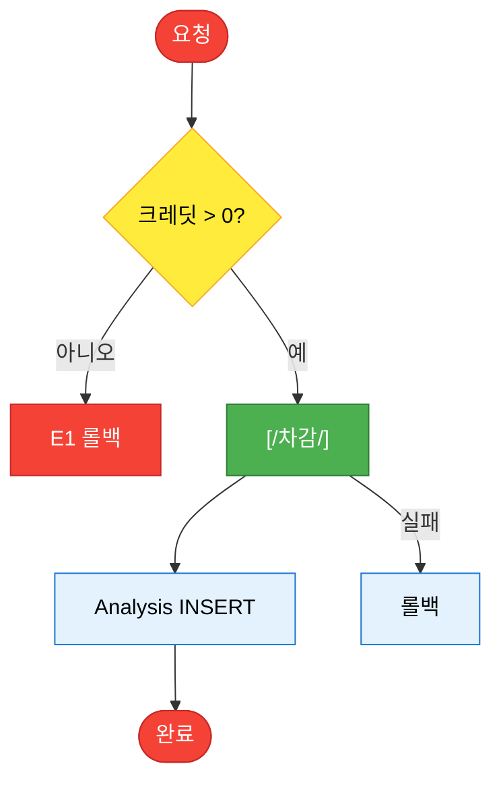
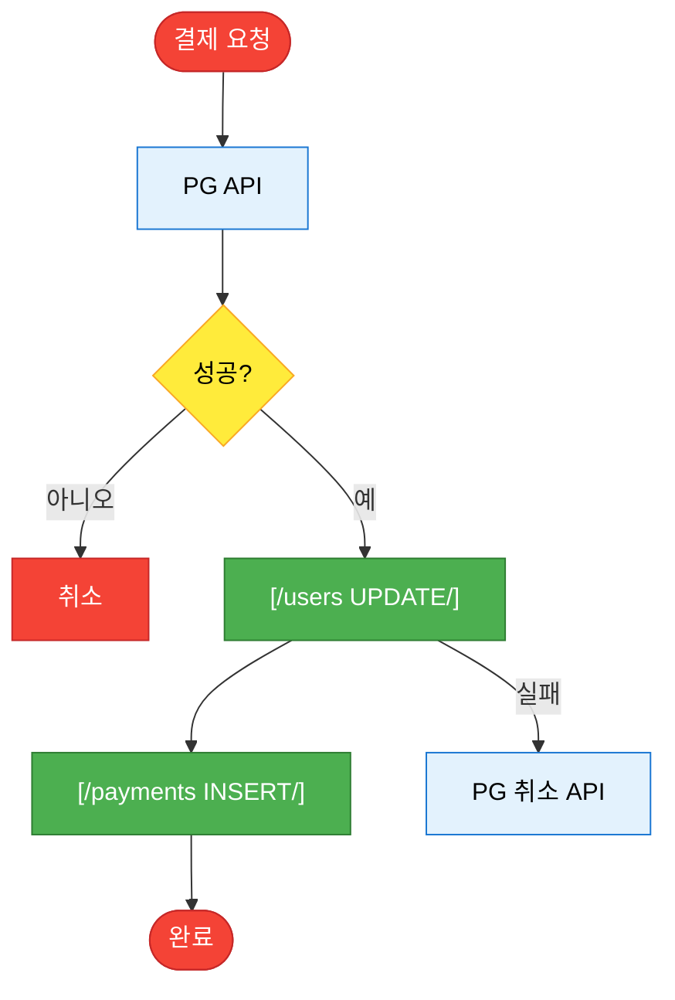
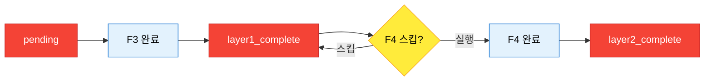

# dysprime Entity Relationship Diagram (ERD)

**Version 1.1** | **2026-02-07** | **Document Suite: IA v1.4 · FSD v1.3 · ERD v1.1**

---

## 문서 정보

| 항목 | 내용 |
|---|---|
| **프로젝트명** | dysprime: AI 기반 미대 입시 평가·코칭 플랫폼 |
| **기반 문서** | dysprime FSD v1.3, IA v1.4 참조 |
| **작성 목적** | 물리적 데이터베이스 설계 및 스키마 명세 |
| **대상 독자** | Backend 개발자, DBA, 시스템 아키텍트 |
| **DB 환경** | Firestore (App DB) + BigQuery (Analysis/Admission DB) |
| **설계 기준** | 관계형 모델(RDBMS) 논리적 엄밀함 준수 |

---

## 목차

1. [Entity Relationship Diagram](#1-entity-relationship-diagram-visual)
2. [Data Dictionary](#2-data-dictionary-schema-specification)
3. [Enum & Type Definitions](#3-enum--type-definitions)
4. [Constraints (논리적 제약)](#4-constraints-논리적-제약)
5. [Access Patterns & Indexing Strategy](#5-access-patterns--indexing-strategy)
6. [Transaction & Concurrency Notes](#6-transaction--concurrency-notes)

---

## 1. Entity Relationship Diagram (Visual)

### 1.1 Mermaid ERD



### 1.2 Cardinality 정리

| Relationship | Cardinality | Description |
|---|---|---|
| USERS → ANALYSES | 1:N | 한 사용자가 여러 작품 업로드 가능 |
| USERS → CHAT_SESSIONS | 1:N | 한 사용자가 여러 챗봇 세션 생성 가능 |
| USERS → PAYMENTS | 1:N | 한 사용자가 여러 결제 이력 보유 |
| ANALYSES → CHAT_SESSIONS | 1:N | 한 분석당 여러 챗봇 세션(재질문) 가능 |
| CHAT_SESSIONS → CHAT_MESSAGES | 1:N | 한 세션당 여러 메시지(대화 히스토리) |

---

## 2. Data Dictionary (Schema Specification)

### 2.1 Table: `users`

**설명**: 사용자 계정, 프로필, 성적, 구독 정보

| Field Name | Type | Nullable | Default | Constraint | Description |
|:---|:---|:---|:---|:---|:---|
| `user_id` | STRING | N | Auto | PK | 사용자 고유 식별자 (예: `usr_abc123`) |
| `email` | STRING | N | - | UNIQUE | 로그인 이메일 주소 |
| `password_hash` | STRING | N | - | - | bcrypt 해시 비밀번호 |
| `nickname` | STRING | N | - | UNIQUE, 2-10자 | 사용자 닉네임 |
| `grade` | ENUM | N | - | - | 학년: `고1`, `고2`, `고3`, `재수`, `N수` |
| `domain` | ENUM | N | - | - | 입시 도메인: `기초디자인`, `기초소양` |
| `korean_grade` | INTEGER | Y | NULL | 1-9 | 국어 수능/모의고사 등급 |
| `english_grade` | INTEGER | Y | NULL | 1-9 | 영어 수능/모의고사 등급 |
| `art_grade` | INTEGER | Y | NULL | 1-9 | 예체능 수능/모의고사 등급 |
| `subscription_plan` | ENUM | N | `Free` | - | 구독 플랜: `Free`, `Basic`, `Premium` |
| `remaining_credits` | INTEGER | N | 2 | ≥0 | 남은 평가 횟수 (**동시성 이슈 주의**, 트랜잭션 필수) |
| `subscription_started_at` | TIMESTAMP | Y | NULL | - | 유료 구독 시작 시각 |
| `next_billing_date` | TIMESTAMP | Y | NULL | - | 다음 결제 예정일 |
| `last_credit_reset_at` | TIMESTAMP | Y | NULL | - | 마지막 크레딧 리셋 시각 (월간 리셋 또는 구독 갱신일 리셋 추적) |
| `created_at` | TIMESTAMP | N | Auto | - | 계정 생성 시각 |
| `updated_at` | TIMESTAMP | N | Auto | - | 최종 수정 시각 |

**Indexes**:
- Primary: `user_id`
- Unique: `email`, `nickname`
- Composite: `subscription_plan ASC`, `created_at DESC` (구독별 가입자 조회)

---

### 2.2 Table: `analyses`

**설명**: 작품 분석 결과 (Vision AI + Theory Engine + Insights)

| Field Name | Type | Nullable | Default | Constraint | Description |
|:---|:---|:---|:---|:---|:---|
| `analysis_id` | STRING | N | Auto | PK | 분석 고유 식별자 (예: `anl_xyz789`) |
| `user_id` | STRING | N | - | FK → users.user_id | 작품 소유자 |
| `image_url` | STRING | N | - | - | Cloud Storage Signed URL |
| `problem_text` | STRING | Y | NULL | Max 500자 | 문제 텍스트 |
| `problem_image_url` | STRING | Y | NULL | - | 문제 이미지 URL |
| `time_limit` | ENUM | Y | NULL | - | `제한없음`, `3시간`, `4시간` |
| `status` | ENUM | N | `pending` | - | 분석 상태: `pending`, `layer1_complete`, `layer2_complete` |
| `scores` | JSON | Y | NULL | - | **Layer 1 결과**, 5개 지표 점수 (상세 아래) |
| `total_score` | FLOAT | Y | NULL | 0-100 | 종합 점수 (가중 평균) |
| `grade` | ENUM | Y | NULL | - | 등급: `A`, `B`, `C`, `D`, `E`, `F` |
| `fix_scope` | ENUM | Y | NULL | - | 우선순위: `StructureRebuild`, `DetailTuning` |
| `embedding` | ARRAY(FLOAT) | Y | NULL | 1408-dim | Multimodal Embedding 벡터 |
| `university_predictions` | JSON | Y | NULL | - | **Layer 2 결과**, 합격 확률 배열 (상세 아래) |
| `layer1_completed_at` | TIMESTAMP | Y | NULL | - | Layer 1 완료 시각 |
| `layer2_completed_at` | TIMESTAMP | Y | NULL | - | Layer 2 완료 시각 |
| `created_at` | TIMESTAMP | N | Auto | - | 분석 생성 시각 (업로드 시각) |

**Indexes**:
- Primary: `analysis_id`
- Foreign Key: `user_id`
- Composite: `user_id ASC`, `created_at DESC` (사용자별 작품 목록 최신순)
- Composite: `user_id ASC`, `status ASC`, `created_at DESC` (완료된 분석만 조회)

#### 2.2.1 JSON Field: `scores`

**구조**:
```json
{
  "density": 80,          // 밀도 (0-100)
  "shapePower": 70,       // 형태력 (0-100)
  "completion": 65,       // 완성도 (0-100)
  "coherence": 85,        // 정합성 (0-100)
  "thinking": 75          // 사고력 (0-100)
}
```

**스키마 (JSON Schema)**:
```json
{
  "type": "object",
  "required": ["density", "shapePower", "completion", "coherence", "thinking"],
  "properties": {
    "density": { "type": "number", "minimum": 0, "maximum": 100 },
    "shapePower": { "type": "number", "minimum": 0, "maximum": 100 },
    "completion": { "type": "number", "minimum": 0, "maximum": 100 },
    "coherence": { "type": "number", "minimum": 0, "maximum": 100 },
    "thinking": { "type": "number", "minimum": 0, "maximum": 100 }
  }
}
```

#### 2.2.2 JSON Field: `university_predictions`

**구조**:
```json
[
  {
    "universityName": "건국대학교",
    "department": "디자인학과",
    "line": "HIGH",
    "probability": 68,
    "similarStudentsCount": 340
  },
  {
    "universityName": "동국대학교",
    "department": "디자인학부",
    "line": "HIGH",
    "probability": 62,
    "similarStudentsCount": 280
  }
]
```

**스키마 (JSON Schema)**:
```json
{
  "type": "array",
  "items": {
    "type": "object",
    "required": ["universityName", "department", "line", "probability"],
    "properties": {
      "universityName": { "type": "string" },
      "department": { "type": "string" },
      "line": { "type": "string", "enum": ["TOP", "HIGH", "MID", "LOW"] },
      "probability": { "type": "integer", "minimum": 0, "maximum": 100 },
      "similarStudentsCount": { "type": "integer", "minimum": 0 }
    }
  }
}
```

**특이사항**: 
- `university_predictions`는 **Layer 2 완료 후에만 존재**하므로, 초기 생성(F2) 및 Layer 1 완료(F3) 시점에는 **NULL**이어야 함.
- 성적 데이터 미입력 시 영구적으로 NULL 유지 가능.

#### 2.2.3 FSD-ERD 필드 매핑 (Cross-Check)

| FSD (기능/필드) | ERD 테이블·컬럼 | 비고 |
|:---|:---|:---|
| **F2 Input** `problemText` | `analyses.problem_text` | 1:1 |
| **F2 Input** `timeLimit` | `analyses.time_limit` | 1:1 |
| **F2 Input** `problemImageUrl` | `analyses.problem_image_url` | 1:1 |
| **F2 Process** `imageUrl` | `analyses.image_url` | 1:1 |
| **F2 Process** `status` (pending) | `analyses.status` | 1:1 |
| **F4 Output** `universityPredictions` | `analyses.university_predictions` | 1:1 (FSD camelCase ↔ ERD snake_case) |
| **F3 Output** `scores`, `grade`, `fixScope`, `status` | `analyses.scores`, `grade`, `fix_scope`, `status`, `layer1_completed_at` | 1:1 |
| **F5** `chatSessions`, `chat_messages` | `chat_sessions`, `chat_messages` | 1:1 |
| **F6** 단건 조회 | `analyses` 전체 필드 | F6 출력 = §2.2 필드 |
| **F7-1** `users` UPDATE, `payments` INSERT | `users` (subscription_plan, remaining_credits, next_billing_date, subscription_started_at, last_credit_reset_at), `payments` | 1:1 |
| **F7-2** 조회 | `users.subscription_plan`, `remaining_credits`, `next_billing_date` | 1:1 |

---

### 2.3 Table: `chat_sessions`

**설명**: AI 멘토 챗봇 세션 (분석별 대화 컨텍스트)

| Field Name | Type | Nullable | Default | Constraint | Description |
|:---|:---|:---|:---|:---|:---|
| `session_id` | STRING | N | Auto | PK | 세션 고유 식별자 (예: `chat_abc123`) |
| `analysis_id` | STRING | N | - | FK → analyses.analysis_id | 참조 분석 |
| `user_id` | STRING | N | - | FK → users.user_id | 세션 소유자 |
| `created_at` | TIMESTAMP | N | Auto | - | 세션 생성 시각 |
| `updated_at` | TIMESTAMP | N | Auto | - | 최종 메시지 시각 |

**Indexes**:
- Primary: `session_id`
- Foreign Key: `analysis_id`, `user_id`
- Composite: `analysis_id ASC`, `created_at DESC` (분석별 세션 목록)

---

### 2.4 Table: `chat_messages`

**설명**: 챗봇 대화 메시지 (세션 내 개별 메시지)

| Field Name | Type | Nullable | Default | Constraint | Description |
|:---|:---|:---|:---|:---|:---|
| `message_id` | STRING | N | Auto | PK | 메시지 고유 식별자 |
| `session_id` | STRING | N | - | FK → chat_sessions.session_id | 소속 세션 |
| `role` | ENUM | N | - | - | 발신자: `user`, `assistant` |
| `content` | TEXT | N | - | Max 2000자 | 메시지 내용 |
| `created_at` | TIMESTAMP | N | Auto | - | 메시지 생성 시각 |

**Indexes**:
- Primary: `message_id`
- Foreign Key: `session_id`
- Composite: `session_id ASC`, `created_at ASC` (시간순 대화 조회)

**Firestore 구현 시**:
- `chat_messages`를 `chat_sessions`의 **Sub-collection**으로 설계 가능
- 경로: `chat_sessions/{sessionId}/messages/{messageId}`
- 장점: 세션별 메시지 자동 그룹화, 쿼리 효율

---

### 2.5 Table: `payments`

**설명**: 결제 이력

| Field Name | Type | Nullable | Default | Constraint | Description |
|:---|:---|:---|:---|:---|:---|
| `payment_id` | STRING | N | Auto | PK | 결제 고유 식별자 |
| `user_id` | STRING | N | - | FK → users.user_id | 결제 사용자 |
| `amount` | INTEGER | N | - | >0, 원 단위 | 결제 금액 |
| `plan` | ENUM | N | - | - | 결제 플랜: `Basic`, `Premium` |
| `payment_method` | ENUM | N | - | - | 결제 수단: `card`, `kakaopay`, `naverpay` |
| `status` | ENUM | N | `success` | - | 결제 상태: `success`, `failed`, `refund` |
| `paid_at` | TIMESTAMP | N | Auto | - | 결제 완료 시각 |

**Indexes**:
- Primary: `payment_id`
- Foreign Key: `user_id`
- Composite: `user_id ASC`, `paid_at DESC` (사용자별 결제 이력)

---

## 3. Enum & Type Definitions

### 3.1 User-related Enums

| Enum Type | Values | Description |
|:---|:---|:---|
| `GradeEnum` | `고1`, `고2`, `고3`, `재수`, `N수` | 학년 |
| `DomainEnum` | `기초디자인`, `기초소양` | 입시 도메인 |
| `PlanType` | `Free`, `Basic`, `Premium` | 구독 플랜 |

### 3.2 Analysis-related Enums

| Enum Type | Values | Description |
|:---|:---|:---|
| `AnalysisStatus` | `pending`, `layer1_complete`, `layer2_complete` | 분석 진행 상태 |
| `TimeLimitEnum` | `제한없음`, `3시간`, `4시간` | 작품 제작 시간 |
| `GradeType` | `A`, `B`, `C`, `D`, `E`, `F` | 작품 등급 |
| `FixScopeType` | `StructureRebuild`, `DetailTuning` | 우선순위 유형 |
| `UniversityLineType` | `TOP`, `HIGH`, `MID`, `LOW` | 대학 라인 |

### 3.3 Chat-related Enums

| Enum Type | Values | Description |
|:---|:---|:---|
| `MessageRole` | `user`, `assistant` | 메시지 발신자 |

### 3.4 Payment-related Enums

| Enum Type | Values | Description |
|:---|:---|:---|
| `PaymentPlanType` | `Basic`, `Premium` | 결제 가능 플랜 (Free 제외) |
| `PaymentMethod` | `card`, `kakaopay`, `naverpay` | 결제 수단 |
| `PaymentStatus` | `success`, `failed`, `refund` | 결제 상태 |

---

## 4. Constraints (논리적 제약)

Firestore는 DB 수준 Check Constraint를 지원하지 않으므로, 아래 규칙은 **애플리케이션·Cloud Functions 검증 규칙**으로 반드시 보장한다.

| Rule | 제약 내용 | 보장 방법 |
|:---|:---|:---|
| **Rule 1** | `users.remaining_credits >= 0` | Atomic Decrement 또는 Optimistic Locking. 크레딧 차감은 반드시 트랜잭션 내에서 수행하여 동시 요청 시에도 0 미만으로 감소하지 않도록 함. |
| **Rule 2** | `subscription_plan = 'Free'`인 사용자는 `payments` 레코드가 없을 수 있음. 유료 플랜(Basic, Premium) 결제 시에만 `payments`에 INSERT되며, 해당 레코드에만 `payment_method` 등이 존재. | F7 결제 플로우에서만 `payments` 생성. Free 사용자에 대한 결제 행 없음. |
| **Rule 3** | **analyses 상태–데이터 정합성**: `status = 'pending'`이면 `scores` = NULL, `university_predictions` = NULL. `status = 'layer1_complete'`이면 `scores` NOT NULL, `university_predictions` = NULL. `status = 'layer2_complete'`이면 `scores`, `university_predictions` NOT NULL. | F3/F4 Cloud Functions에서 상태 전이 시 위 조건을 만족하도록만 업데이트. F4 진입 시 FSD Pre-condition(성적 존재, status = layer1_complete) 검사. |

---

## 5. Access Patterns & Indexing Strategy

### 5.1 Firestore 최적화 복합 인덱스

| Use Case | Query Pattern | Composite Index | Reason |
|:---|:---|:---|:---|
| **내 작품 목록 최신순** | `WHERE user_id = ? ORDER BY created_at DESC` | `user_id ASC, created_at DESC` | 대시보드 메인 쿼리 |
| **완료된 분석만 조회** | `WHERE user_id = ? AND status = 'layer2_complete' ORDER BY created_at DESC` | `user_id ASC, status ASC, created_at DESC` | 결과 페이지 필터링 |
| **특정 분석의 챗봇 세션** | `WHERE analysis_id = ? ORDER BY created_at DESC` | `analysis_id ASC, created_at DESC` | 재질문 시 세션 조회 |
| **세션 내 대화 시간순** | `WHERE session_id = ? ORDER BY created_at ASC` | `session_id ASC, created_at ASC` | 대화 히스토리 |
| **사용자 결제 이력** | `WHERE user_id = ? ORDER BY paid_at DESC` | `user_id ASC, paid_at DESC` | 구독 관리 페이지 |
| **구독 플랜별 사용자** | `WHERE subscription_plan = ? ORDER BY created_at DESC` | `subscription_plan ASC, created_at DESC` | Admin 대시보드 |

### 5.2 BigQuery 분석 쿼리

| Use Case | Query |
|:---|:---|
| **성적 + 작품 점수 기반 유사 합격자 검색** | `SELECT * FROM admission_db WHERE domain = ? AND korean_grade_avg <= ? AND artwork_score_avg BETWEEN ? AND ? ORDER BY admission_count DESC LIMIT 20` |
| **임베딩 기반 유사 작품 검색 (Phase 4+)** | `SELECT * FROM analyses WHERE embedding <-> ? < 0.3 ORDER BY distance LIMIT 10` (벡터 유사도) |

---

## 6. Transaction & Concurrency Notes

### 6.1 크레딧 차감 트랜잭션 (F2 작품 업로드)

**FSD 매핑**: FSD F2 Process 단계 4~5와 동일 트랜잭션. Analysis 문서 생성 + `users.remaining_credits` 감소를 `runTransaction` 내에서 한 번에 수행한다.

**문제**: `users.remaining_credits` 필드는 동시 업로드 시 Race Condition 발생 가능

**해결 방안 (Firestore)**:
```javascript
// Atomic Transaction
const userRef = firestore.doc(`users/${userId}`);
await firestore.runTransaction(async (transaction) => {
  const userDoc = await transaction.get(userRef);
  const currentCredits = userDoc.data().remainingCredits;

  if (currentCredits <= 0) {
    throw new Error('E1: 크레딧 부족');
  }

  transaction.update(userRef, {
    remainingCredits: currentCredits - 1
  });
});
```

**설계 원칙**:
- 크레딧 차감은 **반드시 트랜잭션** 내에서 수행
- 동시 요청 시 하나만 성공, 나머지는 Retry 또는 실패 처리

**플로우 (Mermaid, IA v1.4 플로우 규칙)**



### 6.2 결제 후 플랜 업그레이드 (F7-1)

**트랜잭션 범위**:
1. PG 결제 API 호출 (외부)
2. 결제 성공 시:
   - `users.subscription_plan` UPDATE
   - `users.remaining_credits` RESET (플랜별 한도)
   - `users.last_credit_reset_at` UPDATE (결제 완료 시각으로 갱신, 구독 갱신일 리셋 추적)
   - `payments` INSERT

**롤백 전략**:
- PG 결제 성공 후 DB 업데이트 실패 시: PG 결제 취소 API 호출
- 멱등성(Idempotency) 보장: `payment_id`를 PG 주문번호와 동일하게 설정

**플로우 (Mermaid, IA v1.4 플로우 규칙)**



### 6.3 분석 상태 변경 (F3, F4)

**상태 전이 규칙**:
```
pending → layer1_complete → layer2_complete
```

**Lock-free 설계**:
- 각 Layer는 독립적으로 실행 (F3, F4는 별도 Cloud Function)
- 상태 변경은 낙관적 잠금(Optimistic Locking) 사용:
  ```javascript
  // F3 완료 시
  await analysesRef.update({
    status: 'layer1_complete',
    scores: {...},
    grade: 'C',
    // ... 기타 필드
  });

  // F4는 status가 'layer1_complete'일 때만 실행
  ```

**플로우 (Mermaid, IA v1.4 플로우 규칙)**



---

## 7. 하이브리드 아키텍처 설계

### 7.1 Firestore vs BigQuery 역할 분담

| 데이터 유형 | 저장소 | 이유 |
|:---|:---|:---|
| **사용자 계정 (users)** | Firestore | 트랜잭션, 실시간 업데이트 필요 |
| **작품 분석 (analyses)** | Firestore + BigQuery | Firestore: 실시간 조회, BigQuery: 분석/로깅 |
| **챗봇 세션 (chat_sessions)** | Firestore | 실시간 대화, 낮은 지연시간 |
| **결제 이력 (payments)** | Firestore + BigQuery | Firestore: 트랜잭션, BigQuery: 회계 분석 |
| **입시 통계 (admission_db)** | BigQuery | 읽기 전용, 대용량 집계 쿼리 |

### 7.2 데이터 동기화 전략

```
Firestore (Write) → Cloud Functions → BigQuery (Append)
```

**자동 동기화 트리거**:
- `analyses` 생성/업데이트 시 → BigQuery `analyses_log` 테이블에 INSERT
- `payments` 생성 시 → BigQuery `payments_log` 테이블에 INSERT
- 목적: BI 대시보드, 데이터 분석, ML 학습

---

## 8. 보안 & 접근 제어

### 8.1 Firestore Security Rules (예시)

```javascript
rules_version = '2';
service cloud.firestore {
  match /databases/{database}/documents {

    // users: 본인만 읽기/쓰기
    match /users/{userId} {
      allow read, write: if request.auth.uid == userId;
    }

    // analyses: 본인 작품만 읽기/쓰기
    match /analyses/{analysisId} {
      allow read: if request.auth.uid == resource.data.user_id;
      allow create: if request.auth.uid == request.resource.data.user_id;
      allow update, delete: if request.auth.uid == resource.data.user_id;
    }

    // chat_sessions: 본인 세션만 읽기/쓰기
    match /chat_sessions/{sessionId} {
      allow read, write: if request.auth.uid == resource.data.user_id;

      // Sub-collection: messages
      match /messages/{messageId} {
        allow read, write: if request.auth.uid == get(/databases/$(database)/documents/chat_sessions/$(sessionId)).data.user_id;
      }
    }

    // payments: 본인 이력만 읽기
    match /payments/{paymentId} {
      allow read: if request.auth.uid == resource.data.user_id;
      allow write: if false; // 서버 측에서만 생성
    }
  }
}
```

### 8.2 API 레벨 권한 체크

| Endpoint | 권한 |
|:---|:---|
| `POST /api/analyses` | JWT 필수 + `remaining_credits > 0` |
| `GET /api/analyses/{analysisId}` | JWT 필수 + `analyses.user_id == auth.uid` |
| `POST /api/chat/{analysisId}` | JWT 필수 + `subscription_plan >= Basic` |
| `POST /api/subscriptions/upgrade` | JWT 필수 |

---

## 9. 스키마 마이그레이션 전략

### Phase 1 → Phase 2 예상 변경사항

| 변경 사항 | 영향 범위 | 전략 |
|:---|:---|:---|
| **기초소양 평가 항목 추가** | `analyses.scores` 스키마 변경 | JSON 필드 확장 (하위 호환성 유지) |
| **Family 플랜 추가** | `users.subscription_plan` Enum | Enum 값 추가 (기존 데이터 무영향) |
| **성장 추적 그래프** | 신규 테이블 `growth_history` | 신규 생성 (기존 테이블 무영향) |

**Backward Compatibility 원칙**:
- JSON 필드는 선택적 키(Optional Keys) 허용
- Enum 추가는 기존 값에 영향 없음
- 신규 테이블 추가는 기존 쿼리 무영향

---

## 문서 변경 이력

| Version | Date | Author | Changes |
|---|---|---|---|
| 1.0 | 2026-02-06 | - | FSD v1.1 기반 초안 작성 (5개 테이블, Mermaid ERD, JSON 스키마 상세화) |
| 1.1 | 2026-02-07 | - | 문서 스위트 정합성: last_credit_reset_at, Constraints 섹션, Transaction Note FSD 매핑, FSD-ERD 필드 Cross-Check |
| 1.1 | 2026-02-07 | - | §6 트랜잭션 플로우 Mermaid 추가(IA v1.4 플로우 규칙 정합) |
| 1.1 | 2026-02-07 | - | §2.2.3 FSD-ERD Cross-Check F3/F5/F6/F7 행 추가(문서 스위트 최종 정합성 체크 반영) |

---

*© 2026 dysprime. All rights reserved.*
