# dysprime 기능명세서 (Functional Specification Document)

**Version 1.3** | **2026-02-07** | **Document Suite: IA v1.4 · FSD v1.3 · ERD v1.1**

---

## 문서 정보

| 항목 | 내용 |
|---|---|
| **프로젝트명** | dysprime: AI 기반 미대 입시 평가·코칭 플랫폼 |
| **기반 문서** | dysprime BRD v4.0, IA v1.4 (플로우 그리드·노드/색상 규칙·Mermaid) |
| **작성 목적** | MVP 개발을 위한 상세 기능 명세 |
| **대상 독자** | 개발팀(Backend, Frontend, AI/ML), PM, 디자이너 |
| **Phase** | Phase 1: MVP (2026 Q1) |

---

## 목차

1. [개요 및 범위](#1-개요-및-범위)
2. [사용자 역할 및 권한](#2-사용자-역할-및-권한)
3. [상세 기능 로직](#3-상세-기능-로직)
   - [F1: 회원가입/로그인](#f1-회원가입로그인)
   - [F1.5: 성적/프로필 입력](#f15-성적프로필-입력)
   - [F2: 작품 업로드](#f2-작품-업로드)
   - [F3: Vision AI 작품 평가 (Layer 1)](#f3-vision-ai-작품-평가-layer-1)
   - [F4: 입시 DB 매칭 (Layer 2)](#f4-입시-db-매칭-layer-2)
   - [F5: AI 멘토 챗봇 (Layer 3)](#f5-ai-멘토-챗봇-layer-3)
   - [F6: 평가 결과 조회](#f6-평가-결과-조회)
   - [F7: 구독 관리](#f7-구독-관리)
   - [F7-2: 내 구독 조회](#f7-2-내-구독-조회)
4. [데이터 인터랙션](#4-데이터-인터랙션)  
   - [4.4 기능별 I-P-O-E 요약표](#44-기능별-i-p-o-e-요약표)
5. [Out-of-Scope (MVP 제외)](#5-out-of-scope-mvp-제외)

---

## 1. 개요 및 범위

### 1.1 문서 목적

**BRD 연결**: dysprime BRD v4.0의 3-Layer Architecture (Vision AI → Theory Engine → AI Insights)를 실제 기능으로 구현하기 위한 상세 명세.

**핵심 가치 실현**:
- "AI가 당신의 작품을 분석하고, 합격 가능한 대학을 알려드립니다"
- 학생이 작품 업로드 후 8초 내 A~F 등급 + 합격 확률 + AI 피드백 수신

### 1.2 범위 (Scope)

#### In-Scope (MVP Phase 1, 2026 Q1)

| 기능 ID | 기능명 | BRD 연결 | 우선순위 |
|---|---|---|---|
| **F1** | 회원가입/로그인 | 모든 기능의 전제 | P0 |
| **F1.5** | 성적/프로필 입력(수능 등급) | Layer 2 입력 소스 | P1 |
| **F2** | 작품 업로드 | Layer 1 입력 | P0 |
| **F3** | Vision AI 작품 평가 | Layer 1: A~F 등급 | P0 |
| **F4** | 입시 DB 매칭 | Layer 2: 합격 확률 | P1 |
| **F5** | AI 멘토 챗봇 | Layer 3: fixScope 기반 | P1 |
| **F6** | 평가 결과 조회 | 히스토리 기본 | P0 |
| **F7** | 구독 관리 | Free/Basic/Premium | P1 |

#### Out-of-Scope (MVP 제외, Phase 2+)

| 기능 | 제외 이유 | 예정 Phase |
|---|---|---|
| 성장 추적 그래프 | 최소 2개 이상 작품 필요 | Phase 3 |
| 유사 합격작 검색 | 신뢰 데이터 미확보 | Phase 4+ |
| Family 플랜 | B2C 검증 후 추가 | Phase 3 |
| 학원 대시보드 | B2B 파일럿 필요 | Phase 4 |

### 1.3 선행 조건

| 기능 | 선행 조건 |
|---|---|
| **F2 작품 업로드** | F1 로그인 완료 |
| **F3 Vision AI 평가** | F2 업로드 완료 |
| **F4 입시 DB 매칭** | F3 평가 완료 + F1.5 성적 입력(선택 시에만 Layer 2 실행) |
| **F5 AI 멘토 챗봇** | F3 평가 완료 |
| **F7 구독 관리** | F1 로그인 완료 |

### 1.4 기능 흐름 요약

```
[Guest]
    │
    ▼
┌─────────────────────────────────────────────────────────────┐
│  F1: 회원가입/로그인                                         │
│  • 이메일 가입 → 도메인(기디/기소) 선택 → Free 플랜 시작     │
└─────────────────────────────────────────────────────────────┘
    │
    ▼
┌─────────────────────────────────────────────────────────────┐
│  F1.5: 성적/프로필 입력 (선택)                               │
│  • 대시보드/프로필에서 수능 등급 입력 → F4에서 활용          │
└─────────────────────────────────────────────────────────────┘
    │
    ▼
┌─────────────────────────────────────────────────────────────┐
│  F2: 작품 업로드                                             │
│  • JPG/PNG (≤10MB) → 크레딧 차감 → F3 자동 트리거           │
└─────────────────────────────────────────────────────────────┘
    │
    ▼
┌─────────────────────────────────────────────────────────────┐
│  F3: Vision AI 작품 평가 (Layer 1)                          │
│  • Gemini Vision → 5개 지표 → A~F 등급 → fixScope 계산      │
└─────────────────────────────────────────────────────────────┘
    │
    ├──────────────────────────────┐
    ▼                              ▼
┌─────────────────────┐    ┌─────────────────────┐
│  F4: 입시 DB 매칭   │    │  F5: AI 멘토 챗봇   │
│  (Layer 2)          │    │  (Layer 3)          │
│  • 성적 있으면 실행  │    │  • Basic 이상 플랜   │
│  • TOP/HIGH/MID/LOW │    │  • fixScope 기반    │
└─────────────────────┘    └─────────────────────┘
    │                              │
    └──────────────┬───────────────┘
                   ▼
┌─────────────────────────────────────────────────────────────┐
│  F6: 평가 결과 조회                                          │
│  • 등급 + 합격 확률 + AI 피드백 통합 화면                    │
└─────────────────────────────────────────────────────────────┘
```

**기능 흐름 (Mermaid, IA v1.4 플로우 규칙 적용)**

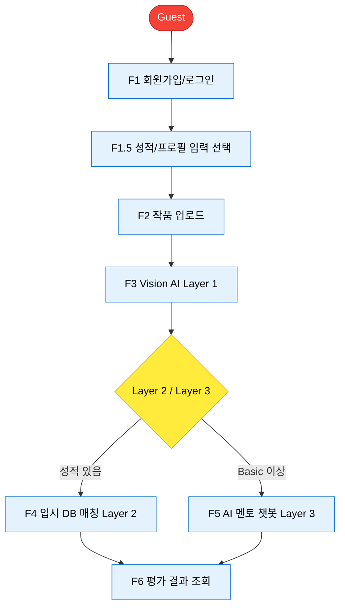

### 1.5 전역 에러 처리 원칙 (IA v1.4 정합)

API 5xx·네트워크 오류 시 **자동 3회 재시도** 후, 실패 시 사용자에게 **Retry 버튼** 제공. 화면별 Empty/Error State 상세는 IA v1.4 §5.6 참조.

---

## 2. 사용자 역할 및 권한

### 2.1 Actor 정의

| Actor | 설명 | 접근 권한 |
|---|---|---|
| **Guest** | 미가입 방문자 | 랜딩 페이지, 회원가입 |
| **Free User** | 가입 후 무료 사용자 | 월 2회 평가 |
| **Basic User** | 19,900원/월 구독자 | 월 10회 평가 + AI 챗봇 무제한 |
| **Premium User** | 49,900원/월 구독자 | 무제한 평가 + 입시DB 상세 리포트 |
| **Admin** | 시스템 관리자 | 전체 데이터 조회/수정 |
| **AI Agent** | 시스템 (자동) | Vision API 호출, Theory Engine 실행 |

### 2.2 CRUD 권한 매트릭스

| 데이터/기능 | Guest | Free | Basic | Premium | Admin |
|---|---|---|---|---|---|
| **작품 업로드** | ❌ | ✅ (2회/월) | ✅ (10회/월) | ✅ (무제한) | ✅ |
| **평가 결과 조회** | ❌ | ✅ (본인만) | ✅ (본인만) | ✅ (본인만) | ✅ (전체) |
| **AI 챗봇 사용** | ❌ | ❌ | ✅ | ✅ | ✅ |
| **입시DB 상세** | ❌ | ❌ | ❌ | ✅ | ✅ |
| **구독 변경** | ❌ | ✅ | ✅ | ✅ | ✅ |
| **계정 삭제** | ❌ | ✅ | ✅ | ✅ | ✅ |

### 2.3 플랜별 크레딧

| 플랜 | 월 평가 횟수 | AI 챗봇 | 입시DB 상세 | 가격 |
|---|---|---|---|---|
| **Free** | 2회 | ❌ | ❌ | 0원 |
| **Basic** | 10회 | ✅ 무제한 | ❌ | 19,900원/월 |
| **Premium** | 무제한 | ✅ 무제한 | ✅ | 49,900원/월 |

**경쟁 대비**: 학원 월 130~180만원(강남권) 대비 Basic 19,900원은 약 98% 저렴(BRD v4.0 시장 데이터 기준).

**크레딧 리셋**: 매월 1일 00:00 KST에 `remainingCredits`를 플랜별 월 한도(Free 2, Basic 10, Premium 무제한)로 리셋한다. 구독 플랜은 결제일 기준 1개월 단위 갱신 시 해당 결제일에 크레딧을 리셋할 수 있다(구현 시 정책 확정).

---


## 3. 상세 기능 로직

---

## F1: 회원가입/로그인

### F1-1: 이메일 회원가입

**Trigger**: 랜딩 페이지 "회원가입" 버튼 클릭

**I-P-O-E 요약**

| 구분 | 요약 |
|------|------|
| **Input** | email, password, nickname, grade, domain |
| **Process** | 1. 이메일 중복 체크 → E1; 2. 닉네임 중복 체크 → E2; 3. 비밀번호 해싱(bcrypt); 4. User 레코드 생성; 5. JWT 발급; 6. (선택) 환영 이메일 |
| **Output** | 201 Created, userId·token·subscriptionPlan·remainingCredits 반환, /dashboard 리다이렉트 |
| **Exception** | E1: 이메일 중복 409; E2: 닉네임 중복 409; E3: 비밀번호 형식 400; E4: 필수 필드 누락 400 |

#### I (Input)

| 필드 | 타입 | 필수 | 제약 조건 | 예시 |
|---|---|---|---|---|
| `email` | String | ✅ | 이메일 형식, 중복 불가 | `student@gmail.com` |
| `password` | String | ✅ | 8자 이상, 영문+숫자 조합 | `Pass1234` |
| `nickname` | String | ✅ | 2~10자, 중복 불가 | `미대준비생` |
| `grade` | Enum | ✅ | `고1`, `고2`, `고3`, `재수`, `N수` | `재수` |
| `domain` | Enum | ✅ | `기초디자인`, `기초소양` | `기초디자인` |

#### P (Process)

```
1. 이메일 중복 체크
   └─ 존재 시 → Exception E1

2. 닉네임 중복 체크
   └─ 존재 시 → Exception E2

3. 비밀번호 해싱 (bcrypt)

4. User 레코드 생성
   {
     "userId": "auto-generated",
     "email": "student@gmail.com",
     "passwordHash": "bcrypt_hash",
     "nickname": "미대준비생",
     "grade": "재수",
     "domain": "기초디자인",
     "subscriptionPlan": "Free",
     "remainingCredits": 2,
     "createdAt": "2026-02-06T19:00:00Z"
   }

5. JWT 토큰 발급 (userId 포함)

6. (선택) 환영 이메일 발송
```

**F1-1 Process (Mermaid, IA v1.4 플로우 규칙)**

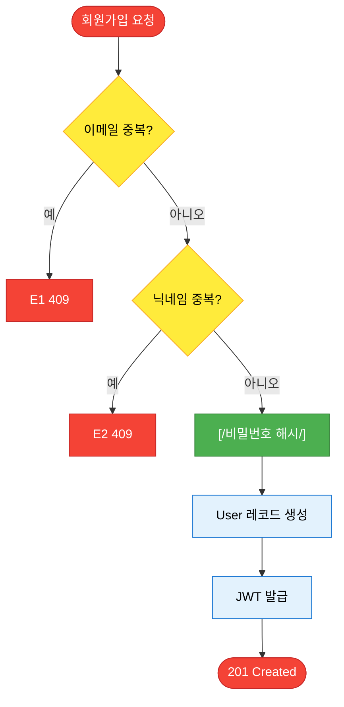

#### O (Output)

**성공 시**:
- HTTP 201 Created
- Response:
  ```json
  {
    "userId": "usr_abc123",
    "token": "jwt_token_here",
    "subscriptionPlan": "Free",
    "remainingCredits": 2
  }
  ```
- 화면: `/dashboard` 리다이렉트

**DB 변경**:
- `users` 테이블에 신규 레코드 1개 생성

#### E (Exception)

| 코드 | 조건 | 메시지 | HTTP |
|---|---|---|---|
| **E1** | 이메일 중복 | "이미 가입된 이메일입니다" | 409 |
| **E2** | 닉네임 중복 | "이미 사용 중인 닉네임입니다" | 409 |
| **E3** | 비밀번호 형식 | "비밀번호는 8자 이상, 영문+숫자 조합이어야 합니다" | 400 |
| **E4** | 필수 필드 누락 | "필수 항목을 모두 입력해주세요" | 400 |

---

### F1-2: 로그인

**Trigger**: 로그인 페이지 "로그인" 버튼 클릭

**I-P-O-E 요약**

| 구분 | 요약 |
|------|------|
| **Input** | email, password |
| **Process** | 1. 이메일 조회 없음 → E1; 2. 비밀번호 검증(bcrypt) 불일치 → E2; 3. JWT 발급(userId, subscriptionPlan 포함); 4. (선택) 로그인 로그 저장 |
| **Output** | 200 OK, token·user 반환, /dashboard 리다이렉트 |
| **Exception** | E1: 이메일 없음 404; E2: 비밀번호 불일치 401; E3: 계정 정지 403 |

#### I (Input)

| 필드 | 타입 | 필수 | 예시 |
|---|---|---|---|
| `email` | String | ✅ | `student@gmail.com` |
| `password` | String | ✅ | `Pass1234` |

#### P (Process)

```
1. 이메일 조회
   └─ 없으면 → Exception E1

2. 비밀번호 검증 (bcrypt compare)
   └─ 불일치 시 → Exception E2

3. JWT 토큰 발급 (userId, subscriptionPlan 포함)

4. (선택) 로그인 로그 저장
```

**F1-2 Process (Mermaid, IA v1.4 플로우 규칙)**

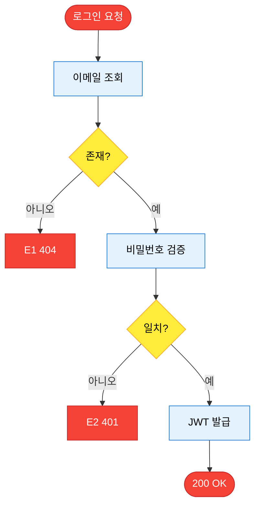

#### O (Output)

**성공 시**:
- HTTP 200 OK
- Response:
  ```json
  {
    "token": "jwt_token_here",
    "user": {
      "userId": "usr_abc123",
      "nickname": "미대준비생",
      "subscriptionPlan": "Free",
      "remainingCredits": 2
    }
  }
  ```
- 화면: `/dashboard` 리다이렉트

#### E (Exception)

| 코드 | 조건 | 메시지 | HTTP |
|---|---|---|---|
| **E1** | 이메일 없음 | "가입되지 않은 이메일입니다" | 404 |
| **E2** | 비밀번호 불일치 | "비밀번호가 일치하지 않습니다" | 401 |
| **E3** | 계정 정지 | "정지된 계정입니다" | 403 |

---

## F1.5: 성적/프로필 입력

**Trigger**: 대시보드 "프로필 수정" 또는 첫 평가 전 안내에서 "성적 입력" 클릭

**I-P-O-E 요약**

| 구분 | 요약 |
|------|------|
| **Input** | koreanGrade, englishGrade, artGrade (1–9, nullable) |
| **Process** | 1. JWT로 userId 확정; 2. 등급 범위 검증(1–9) → 범위 외 시 E1; 3. users UPDATE(koreanGrade, englishGrade, artGrade) |
| **Output** | 200 OK, message·성적 필드 반환, 프로필/대시보드 갱신 |
| **Exception** | E1: 등급 범위 초과 400; E2: 미로그인 401 |

#### I (Input)

| 필드 | 타입 | 필수 | 제약 조건 | 예시 |
|---|---|---|---|---|
| `koreanGrade` | Number | ⬜ | 1–9 등급, nullable | 1 |
| `englishGrade` | Number | ⬜ | 1–9 등급, nullable | 2 |
| `artGrade` | Number | ⬜ | 1–9 등급, nullable | 1 |

BRD "수능/모의고사 등급"과의 대응: 국어·영어·예체능(또는 탐구) 등급. 미입력 시 Layer 2(F4)는 스킵된다.

#### P (Process)

```
1. JWT로 userId 확정

2. 등급 범위 검증 (1–9)
   └─ 범위 외 값 있으면 → Exception E1

3. users 테이블 해당 필드 UPDATE
   └─ koreanGrade, englishGrade, artGrade
```

**F1.5 Process (Mermaid, IA v1.4 플로우 규칙)**

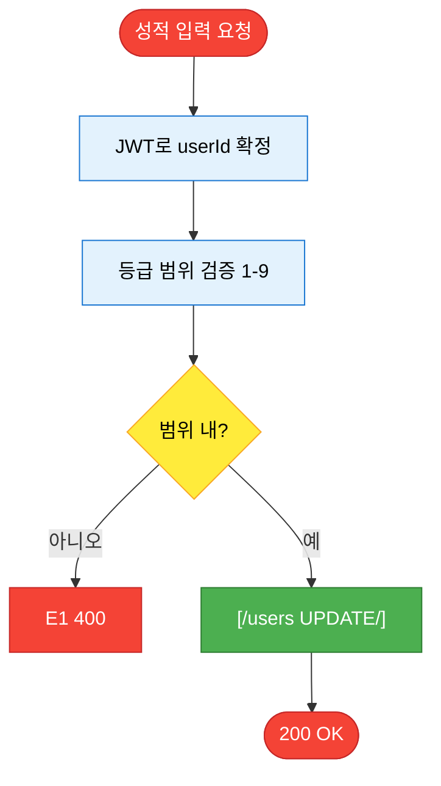

#### O (Output)

**성공 시**:
- HTTP 200 OK
- Response:
  ```json
  {
    "message": "성적이 저장되었습니다",
    "koreanGrade": 1,
    "englishGrade": 2,
    "artGrade": 1
  }
  ```
- 화면: 프로필/대시보드 갱신

**DB 변경**:
- `users` UPDATE (koreanGrade, englishGrade, artGrade)

#### E (Exception)

| 코드 | 조건 | 메시지 | HTTP |
|---|---|---|---|
| **E1** | 등급 범위 초과 | "등급은 1–9 사이로 입력해주세요" | 400 |
| **E2** | 미로그인 | "로그인이 필요합니다" | 401 |

---

## F2: 작품 업로드

**Trigger**: 대시보드 "작품 평가하기" → 파일 선택 → "업로드"

**I-P-O-E 요약**

| 구분 | 요약 |
|------|------|
| **Input** | imageFile(JPG/PNG ≤10MB), problemText, problemImageUrl, timeLimit |
| **Process** | 1. 크레딧 체크 → 0이면 E1; 2. 파일 검증(확장자/용량/MIME) → E2/E3; 3. Cloud Storage 업로드; 4–5. [Transaction] Analysis INSERT + 크레딧 차감; 6. F3 트리거 |
| **Output** | 202 Accepted, analysisId·status·message 반환, 로딩 후 결과 페이지 이동 |
| **Exception** | E1: 크레딧 부족 403; E2: 확장자 오류 400; E3: 용량 초과 400; E4: 업로드 실패 500; E5: 이미지 깨짐 400(환불) |

#### I (Input)

| 필드 | 타입 | 필수 | 제약 조건 | 예시 |
|---|---|---|---|---|
| `imageFile` | File | ✅ | JPG/PNG, ≤10MB | `artwork_001.jpg` |
| `problemText` | String | ⬜ | 최대 500자 | "자유 주제 기초디자인" |
| `problemImageUrl` | String | ⬜ | URL 형식 | `https://...` |
| `timeLimit` | Enum | ⬜ | `제한없음`, `3시간`, `4시간` | `4시간` |

#### P (Process)

```
1. 크레딧 체크
   └─ users.remainingCredits == 0 → Exception E1

2. 파일 검증
   ├─ 확장자: .jpg, .png만 허용 → 아니면 E2
   ├─ 용량: ≤10MB → 초과 시 E3
   └─ MIME 타입 체크

3. Cloud Storage 업로드
   └─ 경로: gs://dysprime-uploads/{userId}/{timestamp}_{filename}
   └─ Signed URL 생성 (유효기간 1년)

4. [Transaction 시작] Analysis 레코드 생성 (status: pending)
   {
     "analysisId": "anl_xyz789",
     "userId": "usr_abc123",
     "imageUrl": "https://storage.googleapis.com/...",
     "problemText": "자유 주제 기초디자인",
     "status": "pending",
     "createdAt": "2026-02-06T20:00:00Z"
   }

5. [Transaction] 크레딧 차감 및 로그 생성
   └─ users.remainingCredits -= 1 (Atomic Decrement, ERD §6.1 참조)
   └─ 트랜잭션 커밋; 실패 시 전체 롤백 (Analysis 미생성 유지 또는 생성 취소, 크레딧 차감 금지)

6. F3 Vision AI 평가 트리거 (백그라운드 Job)
```

**F2 Process (Mermaid, IA v1.4 플로우 규칙)**

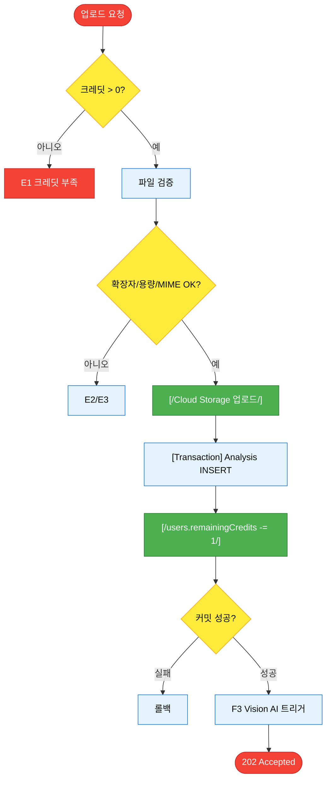

**롤백 정책**: 4~5 단계는 하나의 트랜잭션으로 수행. Analysis INSERT 실패 시 크레딧 차감하지 않음. 크레딧 차감 실패 시 Analysis 레코드 미생성 또는 롤백 유지.

F3 실패(E3·E4) 시 크레딧 환불: 동일 analysisId에 대해 백엔드에서 remainingCredits += 1(환불 트랜잭션) 처리한다. 이는 업로드 시 트랜잭션과 별도의 보상 트랜잭션이다.

#### O (Output)

**성공 시**:
- HTTP 202 Accepted
- Response:
  ```json
  {
    "analysisId": "anl_xyz789",
    "status": "pending",
    "message": "작품을 분석 중입니다. 약 8초 소요됩니다."
  }
  ```
- 화면: 로딩 화면 → F3 완료 시 결과 페이지 자동 이동

**DB 변경**:
- `analyses` INSERT
- `users.remainingCredits` -= 1

#### E (Exception)

| 코드 | 조건 | 메시지 | HTTP | 추가 처리 |
|---|---|---|---|---|
| **E1** | 크레딧 부족 | "평가 횟수를 모두 사용했습니다" | 403 | 업그레이드 모달 |
| **E2** | 확장자 오류 | "JPG 또는 PNG만 가능합니다" | 400 | - |
| **E3** | 용량 초과 | "10MB 이하만 가능합니다" | 400 | - |
| **E4** | 업로드 실패 | "파일 업로드 실패" | 500 | Retry 버튼 |
| **E5** | 이미지 깨짐 | "손상된 이미지입니다" | 400 | 크레딧 환불 (이미지 검증: 업로드 직후 MIME/헤더 검사만 수행, 실제 작품 인식 실패는 F3 완료 후 판정·환불) |

---

## F3: Vision AI 작품 평가 (Layer 1)

**Trigger**: F2 완료 후 자동 실행 (백그라운드)

**I-P-O-E 요약**

| 구분 | 요약 |
|------|------|
| **Input** | analysisId, imageUrl(F2), domain(users) |
| **Process** | 1. Analysis 조회·status≠pending → E1; 2. 도메인별 프롬프트 선택; 3. Gemini Vision API; 4–7. 파싱·점수·등급·fixScope 계산; 8. Embedding 생성; 9. analyses UPDATE(layer1_complete); 10. (성적 있으면) F4 트리거 |
| **Output** | 200 OK(WebSocket), analysisId·status·grade·scores·fixScope 반환, 결과 페이지 등급 카드 |
| **Exception** | E1: 상태 오류 400; E2: API 타임아웃 504; E3: 작품 미검출 400(환불); E4: API 에러 500(재시도 후 환불) |

#### I (Input)

| 필드 | 출처 | 타입 | 예시 |
|---|---|---|---|
| `analysisId` | F2 | String | `anl_xyz789` |
| `imageUrl` | F2 | String | `https://storage...` |
| `domain` | users | Enum | `기초디자인` |

#### P (Process)

```
1. Analysis 레코드 조회
   └─ status ≠ pending → Exception E1

2. 도메인별 프롬프트 선택
   ├─ 기초디자인 → PROMPT_BASIC_DESIGN
   └─ 기초소양 → PROMPT_BASIC_LITERACY
   MVP(v1.1)에서는 기초소양도 기초디자인과 동일 5지표·가중치 적용. 항목 차이는 Phase 2에서 반영 예정.

3. Gemini Vision API 호출
   ├─ 모델: gemini-3-pro-preview
   ├─ 타임아웃: 8초
   └─ 입력: { image, prompt }

4. 응답 파싱
   {
     "density": 80,        // 밀도
     "shapePower": 70,     // 형태력
     "completion": 65,     // 완성도
     "coherence": 85,      // 정합성
     "thinking": 75        // 사고력
   }

5. 종합 점수 계산
   totalScore = density×0.20 + shapePower×0.25 + 
                completion×0.20 + coherence×0.20 + thinking×0.15

6. 등급 매핑
   ┌──────────┬───────┐
   │ 점수     │ 등급  │
   ├──────────┼───────┤
   │ 90-100   │ A     │
   │ 80-89    │ B     │
   │ 70-79    │ C     │
   │ 60-69    │ D     │
   │ 50-59    │ E     │
   │ 0-49     │ F     │
   └──────────┴───────┘

7. fixScope 계산
   structureScore = density×0.3 + shapePower×0.4 + coherence×0.3

   if structureScore < 70:
       fixScope = "StructureRebuild"   // 구조 재설계
   else:
       fixScope = "DetailTuning"       // 디테일 개선

8. Multimodal Embedding 생성
   └─ 모델: multimodalembedding@001 (1408-dim)

9. Analysis 레코드 업데이트
   {
     "status": "layer1_complete",
     "scores": { density, shapePower, completion, coherence, thinking },
     "totalScore": 75,
     "grade": "C",
     "fixScope": "DetailTuning",
     "embedding": [0.123, -0.456, ...],
     "layer1CompletedAt": "2026-02-06T20:00:08Z"
   }

10. (성적 데이터 있으면) F4 입시 DB 매칭 트리거
```

**F3 Process (Mermaid, IA v1.4 플로우 규칙)**

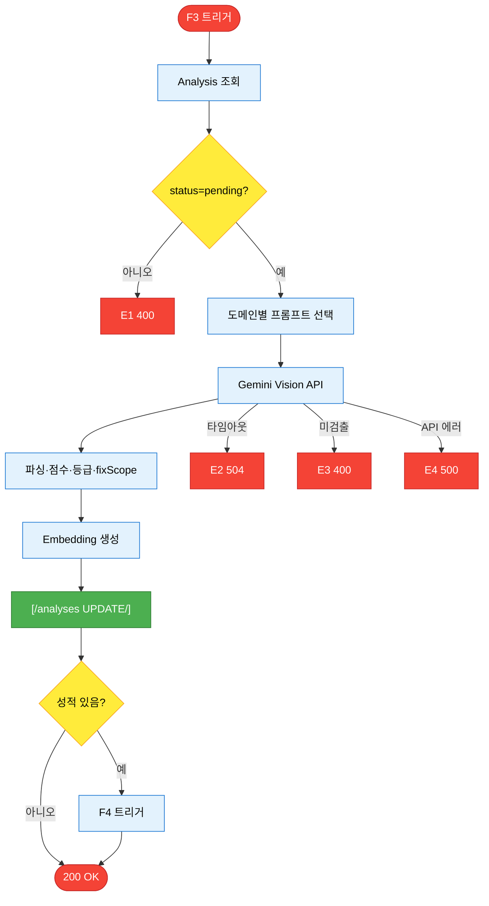

**F3→F4 상태 전이 (Mermaid, IA v1.4 플로우 규칙)**

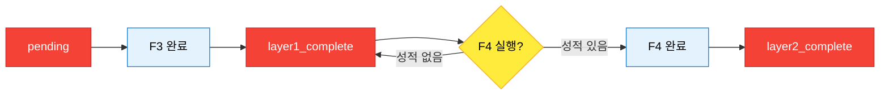

#### O (Output)

**성공 시**:
- HTTP 200 OK (WebSocket 알림)
- Response:
  ```json
  {
    "analysisId": "anl_xyz789",
    "status": "layer1_complete",
    "grade": "C",
    "totalScore": 75,
    "scores": {
      "density": 80,
      "shapePower": 70,
      "completion": 65,
      "coherence": 85,
      "thinking": 75
    },
    "fixScope": "DetailTuning"
  }
  ```
- 화면: 로딩 → 결과 페이지 (등급 카드)

**DB 변경**:
- `analyses` UPDATE (scores, grade, fixScope, status)

#### E (Exception)

| 코드 | 조건 | 메시지 | HTTP | 추가 처리 |
|---|---|---|---|---|
| **E1** | 상태 오류 | "이미 처리된 분석입니다" | 400 | - |
| **E2** | API 타임아웃 | "AI 서버 응답 시간 초과" | 504 | 백그라운드 전환 + 푸시 알림 |
| **E3** | 작품 미검출 | "작품을 인식할 수 없습니다" | 400 | 크레딧 환불 |
| **E4** | API 에러 | "AI 분석 오류" | 500 | Retry: 백엔드 자동 3회 재시도 후 실패 시 크레딧 환불 |

---

## F4: 입시 DB 매칭 (Layer 2)

**Trigger**: F3 완료 후 자동 실행 (성적 데이터가 있는 경우)

**I-P-O-E 요약**

| 구분 | 요약 |
|------|------|
| **Input** | analysisId, totalScore, scores(F3), koreanGrade, englishGrade, artGrade(users) |
| **Process** | 1. 성적 없으면 스킵(layer1_complete 유지); 2. Theory Engine 입력 구성; 3. BigQuery SQL; 4–5. 유사 패턴 매칭·확률 계산; 6. 라인 분류(TOP/HIGH/MID/LOW); 7. 상위 10개 추출; 8. analyses UPDATE(layer2_complete) |
| **Output** | 200 OK, analysisId·status·universityPredictions 반환, 결과 페이지 합격 가능 대학 섹션 |
| **Exception** | E1: 성적 없음(스킵·CTA); E2: 매칭 없음 200; E3: DB 에러 500(스킵) |

**Pre-condition (진입 조건)**: `analyses.status = 'layer1_complete'`, `analyses.scores` IS NOT NULL. Layer 1 실패 또는 미완료 시 F4는 실행하지 않음 (ERD Constraints Rule 3 참조).

#### I (Input)

| 필드 | 출처 | 타입 | 예시 |
|---|---|---|---|
| `analysisId` | F3 | String | `anl_xyz789` |
| `totalScore` | F3 | Number | 75 |
| `scores` | F3 | Object | `{density: 80, ...}` |
| `koreanGrade` | users | Number | 1 |
| `englishGrade` | users | Number | 2 |
| `artGrade` | users | Number | 1 |

#### P (Process)

```
1. 성적 데이터 확인
   └─ 없으면 → 이 단계 스킵 (layer1_complete로 유지)

2. Theory Engine 입력 구성
   Theory Engine v3.0은 BigQuery 입시 DB(NeoPrime)를 조회하는 서비스/래퍼이며, 본 기능(F4)은 해당 엔진 호출 또는 동일 로직의 BigQuery SQL 실행으로 구현한다.
   {
     "studentProfile": { koreanGrade, englishGrade, artGrade },
     "artworkMetrics": { totalScore, density, ... },
     "domain": "기초디자인"
   }

3. BigQuery SQL 실행
   SELECT university_name, department, ...
   FROM admission_db
   WHERE domain = '기초디자인'
     AND korean_grade_avg <= 학생등급+1
     AND artwork_score_avg BETWEEN 학생점수-10 AND 학생점수+10
   ORDER BY admission_count DESC
   LIMIT 20;

4. 유사 합격자 패턴 매칭
   └─ 코사인 유사도 > 0.8인 경우 매칭

5. 합격 확률 계산
   확률 = (유사 합격자 수 / 전체 지원자 수) × 100

6. 대학 라인 분류
   ┌───────────┬───────┐
   │ 확률      │ 라인  │
   ├───────────┼───────┤
   │ ≥70%      │ TOP   │
   │ 50-69%    │ HIGH  │
   │ 30-49%    │ MID   │
   │ <30%      │ LOW   │
   └───────────┴───────┘

7. 상위 10개 대학 추출
   └─ TOP 2개, HIGH 3개, MID 3개, LOW 2개

8. Analysis 레코드 업데이트
   {
     "status": "layer2_complete",
     "universityPredictions": [
       { "universityName": "건국대학교", "line": "HIGH", "probability": 68 },
       ...
     ],
     "layer2CompletedAt": "..."
   }
```

**F4 Process (Mermaid, IA v1.4 플로우 규칙)**

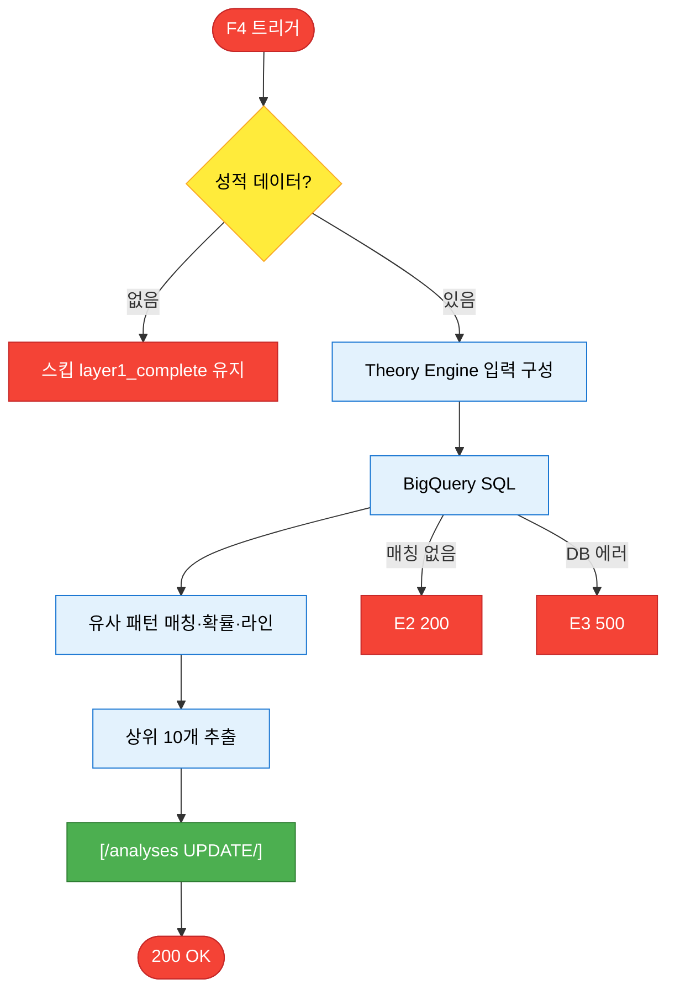

#### O (Output)

**성공 시**:
- HTTP 200 OK
- Response:
  ```json
  {
    "analysisId": "anl_xyz789",
    "status": "layer2_complete",
    "universityPredictions": [
      { "universityName": "건국대학교", "line": "HIGH", "probability": 68 },
      { "universityName": "동국대학교", "line": "HIGH", "probability": 62 }
    ]
  }
  ```
- 화면: 결과 페이지에 "합격 가능 대학" 섹션 추가

**DB 변경**:
- `analyses` UPDATE (universityPredictions, status)

#### E (Exception)

| 코드 | 조건 | 메시지 | HTTP | 추가 처리 |
|---|---|---|---|---|
| **E1** | 성적 없음 | - | - | Layer 2 스킵. F6 결과 화면에 "성적을 입력하면 합격 확률을 볼 수 있어요" 안내 및 성적 입력 CTA 노출 |
| **E2** | 매칭 없음 | "유사 합격 사례 없음" | 200 | "데이터 부족" 안내 |
| **E3** | DB 에러 | "입시 DB 조회 실패" | 500 | Layer 2 스킵 |

---

## F5: AI 멘토 챗봇 (Layer 3)

**Trigger**: 결과 페이지 하단 채팅창에서 "질문하기"

**I-P-O-E 요약**

| 구분 | 요약 |
|------|------|
| **Input** | analysisId, userMessage |
| **Process** | 1. Analysis 조회(F3 완료·fixScope/scores/grade); 2. fixScope 기반 System Prompt 선택; 3. Chat Session 확인/생성; 4. 히스토리(최근 5개); 5. Gemini Chat API; 6–7. 응답 저장·Session 업데이트 |
| **Output** | 200 OK, sessionId·message(role·content·timestamp) 반환, 채팅창에 AI 응답 표시 |
| **Exception** | E1: 플랜 미달 403; E2: 분석 미완료 400; E3: 메시지 초과 400; E4: API 에러 500 |

#### I (Input)

| 필드 | 타입 | 필수 | 예시 |
|---|---|---|---|
| `analysisId` | String | ✅ | `anl_xyz789` |
| `userMessage` | String | ✅ | "밀도를 어떻게 높일 수 있나요?" |

#### P (Process)

```
1. Analysis 레코드 조회
   └─ F3 완료 확인, fixScope/scores/grade 가져오기

2. fixScope 기반 System Prompt 선택
   ┌─ StructureRebuild:
   │  "구도/주제 해석/시선 흐름 중심으로 피드백.
   │   구조 재설계 방법 제시. 미학/톤은 언급 금지."
   │
   └─ DetailTuning:
      "마감/밀도/톤 개선 중심으로 피드백.
       디테일 향상 방법 제시. 구조는 언급하지 않음."

3. Chat Session 확인/생성
   └─ analysisId로 기존 세션 조회, 없으면 신규 생성

4. 대화 히스토리 포함 (최근 5개 메시지; 구현 시 토큰 상한 4K 등 상한 명시)

5. Gemini Chat API 호출
   ├─ 모델: gemini-2.5-flash
   └─ 입력: systemPrompt + context + history + message

6. 응답 수신 및 저장
   {
     "role": "assistant",
     "content": "밀도를 높이려면...",
     "timestamp": "..."
   }

7. Chat Session 업데이트
   └─ messages[] 에 user/assistant 메시지 추가
```

**F5 Process (Mermaid, IA v1.4 플로우 규칙)**

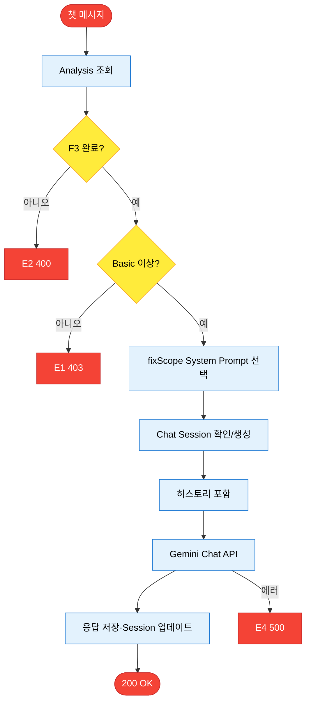

#### O (Output)

**성공 시**:
- HTTP 200 OK
- Response:
  ```json
  {
    "sessionId": "chat_abc123",
    "message": {
      "role": "assistant",
      "content": "밀도를 높이려면 다음을 시도해보세요:

1. 오브젝트 간격을 20% 줄이기
2. 배경 공간 활용도 높이기
3. 매일 30분 밀집 배치 연습",
      "timestamp": "2026-02-06T20:05:05Z"
    }
  }
  ```
- 화면: 채팅창에 AI 응답 표시

**DB 변경**:
- `chatSessions.messages[]` 에 2개 추가

#### E (Exception)

| 코드 | 조건 | 메시지 | HTTP | 추가 처리 |
|---|---|---|---|---|
| **E1** | 플랜 미달 | "Basic 이상 플랜에서 사용 가능" | 403 | 업그레이드 모달 |
| **E2** | 분석 미완료 | "작품 분석 완료 후 사용 가능" | 400 | - |
| **E3** | 메시지 초과 | "500자 이내로 입력해주세요" | 400 | - |
| **E4** | API 에러 | "AI 멘토 응답 실패" | 500 | Retry 버튼 |

---

## F6: 평가 결과 조회

**Trigger**: 대시보드 "내 작품" → 특정 작품 클릭

**I-P-O-E 요약**

| 구분 | 요약 |
|------|------|
| **Input** | analysisId |
| **Process** | 1. Analysis 레코드 조회; 2. 권한 확인(userId 불일치 → E1); 3. 응답 데이터 구성(성적 미입력 시 CTA 안내) |
| **Output** | 200 OK, analysisId·imageUrl·grade·scores·fixScope·universityPredictions·status 등 반환, 결과 페이지 렌더링 |
| **Exception** | E1: 권한 없음 403; E2: 레코드 없음 404 |

#### I (Input)

| 필드 | 타입 | 필수 | 예시 |
|---|---|---|---|
| `analysisId` | String | ✅ | `anl_xyz789` |

#### P (Process)

```
1. Analysis 레코드 조회

2. 권한 확인
   └─ analyses.userId ≠ 로그인 userId → Exception E1

3. 응답 데이터 구성
   status가 layer1_complete이고 universityPredictions가 없을 때(성적 미입력): 성적 미입력 안내 문구 및 성적 입력 CTA 표시

```

**F6 Process (Mermaid, IA v1.4 플로우 규칙)**

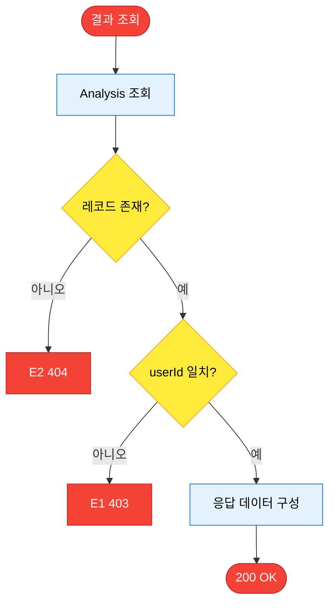

#### O (Output)

**성공 시**:
- HTTP 200 OK
- Response:
  ```json
  {
    "analysisId": "anl_xyz789",
    "imageUrl": "https://...",
    "createdAt": "2026-02-06T20:00:00Z",
    "grade": "C",
    "totalScore": 75,
    "scores": { "density": 80, "shapePower": 70, ... },
    "fixScope": "DetailTuning",
    "universityPredictions": [...],
    "status": "layer2_complete"
  }
  ```
- 화면: 결과 페이지 렌더링

#### E (Exception)

| 코드 | 조건 | 메시지 | HTTP |
|---|---|---|---|
| **E1** | 권한 없음 | "본인 작품만 조회 가능" | 403 |
| **E2** | 레코드 없음 | "존재하지 않는 분석" | 404 |

---

## F7: 구독 관리

### F7-1: 플랜 업그레이드

**Trigger**: 대시보드 "플랜 업그레이드" → 플랜 선택 → "결제하기"

**I-P-O-E 요약**

| 구분 | 요약 |
|------|------|
| **Input** | targetPlan(Basic/Premium), paymentMethod(card/kakaopay/naverpay) |
| **Process** | 1. 현재 플랜 확인 → 동일 시 E1; 2. 결제 금액 계산; 3. PG API 호출; 4. 성공 시 users UPDATE + payments INSERT; 5. 실패 시 E2 |
| **Output** | 200 OK, subscriptionPlan·remainingCredits·nextBillingDate 반환, 업그레이드 완료 모달 → 대시보드 |
| **Exception** | E1: 동일 플랜 400; E2: 결제 실패 402; E3: PG 에러 500 |

#### I (Input)

| 필드 | 타입 | 필수 | 예시 |
|---|---|---|---|
| `targetPlan` | Enum | ✅ | `Basic`, `Premium` |
| `paymentMethod` | Enum | ✅ | `card`, `kakaopay`, `naverpay` |

#### P (Process)

```
1. 현재 플랜 확인
   └─ 동일 플랜이면 → Exception E1

2. 결제 금액 계산
   ├─ Basic: 19,900원/월
   └─ Premium: 49,900원/월

3. PG 결제 API 호출 (Toss Payments 등)

4. 결제 성공 시:
   └─ users 업데이트
      {
        "subscriptionPlan": "Basic",
        "remainingCredits": 10,
        "subscriptionStartedAt": "...",
        "nextBillingDate": "..."
      }
   └─ payments 테이블에 결제 기록

5. 결제 실패 시 → Exception E2
```

**F7-1 결제 플로우 (Mermaid, IA v1.4 플로우 규칙)**

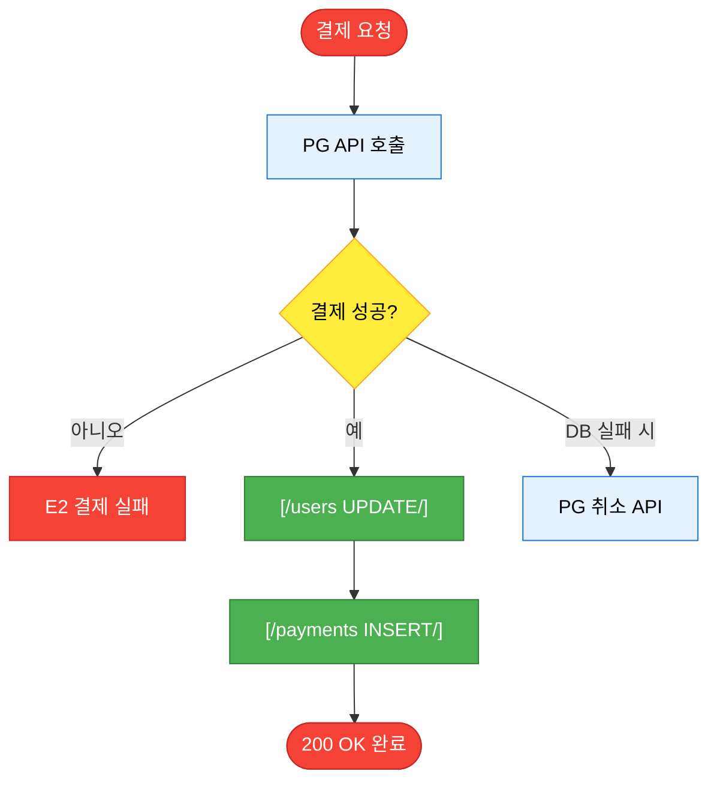

#### O (Output)

**성공 시**:
- HTTP 200 OK
- Response:
  ```json
  {
    "subscriptionPlan": "Basic",
    "remainingCredits": 10,
    "nextBillingDate": "2026-03-06"
  }
  ```
- 화면: "업그레이드 완료" 모달 → 대시보드

**DB 변경**:
- `users` UPDATE
- `payments` INSERT

#### E (Exception)

| 코드 | 조건 | 메시지 | HTTP |
|---|---|---|---|
| **E1** | 동일 플랜 | "이미 해당 플랜 사용 중" | 400 |
| **E2** | 결제 실패 | "결제 실패. 다시 시도해주세요" | 402 |
| **E3** | PG 에러 | "결제 시스템 오류" | 500 |

---

### F7-2: 내 구독 조회

**Trigger**: 대시보드 진입 시 또는 "내 구독" 클릭

**I-P-O-E 요약**

| 구분 | 요약 |
|------|------|
| **Input** | 없음 (JWT로 userId 확정) |
| **Process** | 1. JWT 검증 → 미로그인 시 E1; 2. users에서 subscriptionPlan, remainingCredits, nextBillingDate 조회 |
| **Output** | 200 OK, subscriptionPlan·remainingCredits·nextBillingDate 반환, 대시보드 구독 영역 표시 |
| **Exception** | E1: 미로그인 401 |

#### I (Input)

- 없음 (JWT로 userId 확정)

#### P (Process)

```
1. JWT 검증
   └─ 미로그인 시 → Exception E1

2. users에서 subscriptionPlan, remainingCredits, nextBillingDate 조회
```

**F7-2 Process (Mermaid, IA v1.4 플로우 규칙)**

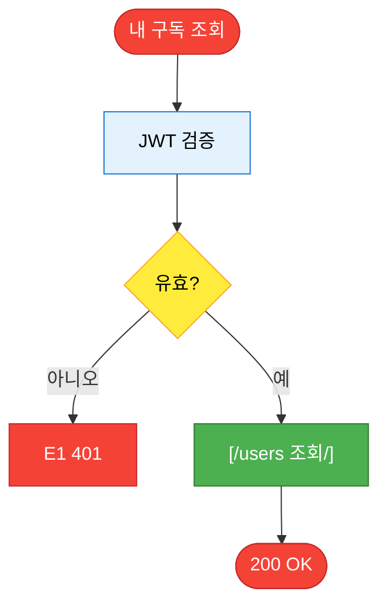

#### O (Output)

**성공 시**:
- HTTP 200 OK
- Response:
  ```json
  {
    "subscriptionPlan": "Basic",
    "remainingCredits": 10,
    "nextBillingDate": "2026-03-06"
  }
  ```
- 화면: 대시보드 상단/구독 영역에 표시

#### E (Exception)

| 코드 | 조건 | 메시지 | HTTP |
|---|---|---|---|
| **E1** | 미로그인 | "로그인이 필요합니다" | 401 |

---

### Scheduled Job: 월간 크레딧 리셋

**Actor**: 시스템 (백엔드)

**동작**:
- **실행 시점**: 매월 1일 00:00 KST. (구독 갱신일 기준 리셋 정책 채택 시에는 해당 결제일에 크레딧 리셋 가능, 구현 시 정책 확정.)
- **처리 내용**: 모든 활성 사용자에 대해 `users.remainingCredits`를 플랜별 월 한도(Free 2, Basic 10, Premium 무제한)로 갱신하고, `users.lastCreditResetAt`(ERD: `last_credit_reset_at`)을 실행 시각으로 업데이트.
- **실행 주체**: Cloud Scheduler + Cloud Function(권장), 또는 로그인 시 "이번 달 리셋 여부" 판단 후 리셋하는 방식 중 하나로 구현.

**ERD 연계**: `users.last_credit_reset_at` 필드로 마지막 리셋 시각 추적 (ERD v1.1 참조).

---

## 4. 데이터 인터랙션

### 4.1 기능별 데이터 저장

| 기능 | 테이블 | 작업 | 주요 필드 | 트랜잭션 |
|---|---|---|---|---|
| **F1-1 회원가입** | `users` | INSERT | userId, email, passwordHash, nickname, grade, domain, subscriptionPlan, remainingCredits | - |
| **F1-2 로그인** | `loginLogs` | INSERT | userId, loginAt, ip (ERD는 별도 로그 서비스로 관리 가능) | - |
| **F1.5 성적 입력** | `users` | UPDATE | koreanGrade, englishGrade, artGrade | - |
| **F2 작품 업로드** | `analyses` | INSERT | analysisId, userId, imageUrl, problemText, status | **트랜잭션 필수** (INSERT+UPDATE 한 묶음) |
| **F2 작품 업로드** | `users` | UPDATE | remainingCredits -= 1 | **트랜잭션 필수** |
| **F3 Vision 평가** | `analyses` | UPDATE | scores, totalScore, grade, fixScope, embedding, status | - |
| **F4 입시 매칭** | `analyses` | UPDATE | universityPredictions, status | - |
| **F5 AI 챗봇** | `chatSessions` | INSERT/UPDATE | sessionId, analysisId, messages[] | - |
| **F7 구독 관리** | `users` | UPDATE | subscriptionPlan, remainingCredits, nextBillingDate, subscriptionStartedAt, lastCreditResetAt(결제·Scheduled Job 시 갱신) | **트랜잭션 필수** (UPDATE+INSERT 한 묶음) |
| **F7 구독 관리** | `payments` | INSERT | paymentId, userId, amount, plan, paidAt | **트랜잭션 필수** |

### 4.2 데이터 검증 (Validation)

| 필드 | 프론트엔드 | 백엔드 |
|---|---|---|
| `email` | 이메일 형식 | 이메일 형식 + 중복 체크 |
| `password` | 8자 이상, 영문+숫자 | bcrypt 해싱 |
| `nickname` | 2~10자 | 중복 체크 |
| `imageFile` | 확장자 (jpg, png) | MIME 타입 + 용량 (≤10MB) |
| `userMessage` | 500자 이하 | 500자 이하 + XSS 방지 |
| `targetPlan` | Enum 선택 | Enum 값 검증 |

### 4.3 예상 테이블 구조

```
┌─────────────────────────────────────────────────────────────┐
│                         users                                │
├─────────────────────────────────────────────────────────────┤
│ userId (PK)          │ String       │ auto-generated        │
│ email                │ String       │ unique                │
│ passwordHash         │ String       │ bcrypt                │
│ nickname             │ String       │ unique, 2-10자        │
│ grade                │ Enum         │ 고1/고2/고3/재수/N수  │
│ domain               │ Enum         │ 기초디자인/기초소양   │
│ koreanGrade          │ Number       │ nullable, 1-9         │
│ englishGrade         │ Number       │ nullable, 1-9         │
│ artGrade             │ Number       │ nullable, 1-9         │
│ subscriptionPlan     │ Enum         │ Free/Basic/Premium    │
│ remainingCredits     │ Number       │ 0-999                 │
│ subscriptionStartedAt│ Timestamp    │ nullable              │
│ nextBillingDate      │ Timestamp    │ nullable              │
│ createdAt            │ Timestamp    │ auto                  │
│ updatedAt            │ Timestamp    │ auto                  │
└─────────────────────────────────────────────────────────────┘

┌─────────────────────────────────────────────────────────────┐
│                       analyses                               │
├─────────────────────────────────────────────────────────────┤
│ analysisId (PK)      │ String       │ auto-generated        │
│ userId (FK)          │ String       │ → users.userId        │
│ imageUrl             │ String       │ Cloud Storage URL     │
│ problemText          │ String       │ nullable, max 500자   │
│ problemImageUrl      │ String       │ nullable              │
│ timeLimit            │ Enum         │ nullable              │
│ status               │ Enum         │ pending/layer1_complete/layer2_complete │
│ scores               │ Object       │ {density, shapePower, completion, coherence, thinking} │
│ totalScore           │ Number       │ 0-100                 │
│ grade                │ Enum         │ A/B/C/D/E/F           │
│ fixScope             │ Enum         │ StructureRebuild/DetailTuning │
│ embedding            │ Array        │ 1408-dim vector       │
│ universityPredictions│ Array        │ [{universityName, line, probability}] │
│ layer1CompletedAt    │ Timestamp    │ nullable (해당 Layer 완료 시각)        │
│ layer2CompletedAt    │ Timestamp    │ nullable (해당 Layer 완료 시각)        │
│ createdAt            │ Timestamp    │ auto                  │
└─────────────────────────────────────────────────────────────┘

┌─────────────────────────────────────────────────────────────┐
│                      chatSessions                            │
├─────────────────────────────────────────────────────────────┤
│ sessionId (PK)       │ String       │ auto-generated        │
│ analysisId (FK)      │ String       │ → analyses.analysisId │
│ userId (FK)          │ String       │ → users.userId        │
│ messages             │ Array        │ [{role, content, timestamp}] │
│ createdAt            │ Timestamp    │ auto                  │
│ updatedAt            │ Timestamp    │ auto                  │
└─────────────────────────────────────────────────────────────┘

┌─────────────────────────────────────────────────────────────┐
│                        payments                              │
├─────────────────────────────────────────────────────────────┤
│ paymentId (PK)       │ String       │ auto-generated        │
│ userId (FK)          │ String       │ → users.userId        │
│ amount               │ Number       │ 원 단위               │
│ plan                 │ Enum         │ Basic/Premium         │
│ paymentMethod        │ Enum         │ card/kakaopay/naverpay│
│ status               │ Enum         │ success/failed/refund │
│ paidAt               │ Timestamp    │ auto                  │
└─────────────────────────────────────────────────────────────┘
```

### 4.4 기능별 I-P-O-E 요약표

§3 상세 기능 로직의 I-P-O-E 요약 인덱스. 상세는 각 기능 절 참조.

| 기능 ID | 기능명 | Input 요약 | Process 단계 수 | Output 요약 | Exception 수 |
|---------|--------|------------|-----------------|------------|--------------|
| F1-1 | 이메일 회원가입 | email, password, nickname, grade, domain | 6 | 201, userId·token, /dashboard | 4 |
| F1-2 | 로그인 | email, password | 4 | 200, token·user, /dashboard | 3 |
| F1.5 | 성적/프로필 입력 | koreanGrade, englishGrade, artGrade | 3 | 200, 성적 저장, 프로필 갱신 | 2 |
| F2 | 작품 업로드 | imageFile, problemText, problemImageUrl, timeLimit | 6 | 202, analysisId·status, 로딩→결과 | 5 |
| F3 | Vision AI 평가 (Layer 1) | analysisId, imageUrl, domain | 10 | 200, grade·scores·fixScope, 결과 카드 | 4 |
| F4 | 입시 DB 매칭 (Layer 2) | analysisId, totalScore, scores, 성적 3개 | 8 | 200, universityPredictions, 합격 대학 섹션 | 3 |
| F5 | AI 멘토 챗봇 | analysisId, userMessage | 7 | 200, sessionId·message, 채팅 응답 | 4 |
| F6 | 평가 결과 조회 | analysisId | 3 | 200, 분석 결과 전체, 결과 페이지 | 2 |
| F7-1 | 플랜 업그레이드 | targetPlan, paymentMethod | 5 | 200, 구독 정보, 업그레이드 모달 | 3 |
| F7-2 | 내 구독 조회 | JWT만 | 2 | 200, subscriptionPlan·remainingCredits·nextBillingDate | 1 |

---

## 5. Out-of-Scope (MVP 제외)

### Phase 2+ 기능

| 기능 ID | 기능명 | 제외 이유 | 예정 Phase |
|---|---|---|---|
| **F8** | 성장 추적 그래프 | 최소 2개 작품 필요 | Phase 3 |
| **F9** | 작품 비교 (A vs B) | F8과 동일 | Phase 3 |
| **F10** | 유사 합격작 검색 | 학원 MOU 데이터 미확보, DIS 실패 경험 | Phase 4+ |
| **F11** | Family 플랜 | B2C 검증 후 추가 | Phase 3 |
| **F12** | 학원 대시보드 | B2B 파일럿 필요 | Phase 4 |
| **F13** | PDF 리포트 다운로드 | Premium 전용, 우선순위 낮음 | Phase 3 |
| **F14** | 소셜 로그인 (Google, Kakao) | 이메일 검증 후 | Phase 2 |
| **F15** | 작품 공유 (SNS) | 커뮤니티 기능 | Phase 5+ |
| **F16** | 정부지원 연계 안내 | 예창패/서울런 정보 제공, 정책 연계 UX | Phase 3 |

---

## 부록: API Endpoints 요약

| 기능 | Method | Endpoint | Auth |
|---|---|---|---|
| **F1-1** | POST | `/api/auth/signup` | ❌ |
| **F1-2** | POST | `/api/auth/login` | ❌ |
| **F1.5** | PATCH | `/api/users/me/grades` 또는 `/api/profile/grades` | ✅ JWT |
| **F2** | POST | `/api/analyses` | ✅ JWT |
| **F3** | (내부) | Cloud Function Trigger | System |
| **F4** | (내부) | Cloud Function Trigger | System |
| **F5** | POST | `/api/chat/{analysisId}` | ✅ JWT + Basic↑ |
| **F6** | GET | `/api/analyses/{analysisId}` | ✅ JWT |
| **F7-1** | POST | `/api/subscriptions/upgrade` | ✅ JWT |
| **F7-2** | GET | `/api/subscriptions/me` | ✅ JWT |

---

## 문서 변경 이력

| Version | Date | Author | Changes |
|---|---|---|---|
| 1.0 | 2026-02-06 | - | BRD v3.0 기반 초안 (F1~F7, I-P-O-E 구조) |
| 1.1 | 2026-02-06 | - | 검토 반영: 성적 입력(F1.5), 크레딧 리셋, F7-2, Theory Engine·F2/F3 정책, BRD 확률 구간 정합 |
| 1.2 | 2026-02-07 | - | BRD v4.0 연동: 기반 문서 버전 업데이트, 가격 비교 문구 구체화(학원 130~180만원 대비), F16 정책연계 Out-of-Scope 추가 |
| 1.3 | 2026-02-07 | - | 문서 스위트 정합성: F2 트랜잭션·롤백 명시, F7 월간 크레딧 리셋 Scheduled Job, 4.1 트랜잭션 필수 표기 |
| 1.3 | 2026-02-07 | - | 플로우 Mermaid 및 규칙 적용(IA v1.4 정합): §1.4 기능 흐름, F2/F7-1/F3→F4 Process 차트 추가 |
| 1.3 | 2026-02-07 | - | 전 기능 I-P-O-E 요약 테이블 및 Process Mermaid 플로우차트 병기: §3 각 기능 절 상단 요약표, F1-1/F1-2/F1.5/F3/F4/F5/F6/F7-2 Process Mermaid 추가, §4.4 I-P-O-E 요약표 |

---

*© 2026 dysprime. All rights reserved.*
