# dysprime Mobile App: Master IA & Sitemap

**Version 1.4** | **2026-02-07** | **Document Suite: IA v1.4 · FSD v1.3 · ERD v1.1**

---

## 문서 정보

| 항목 | 내용 |
|---|---|
| **프로젝트명** | dysprime: AI 기반 미대 입시 평가·코칭 플랫폼 |
| **플랫폼** | Mobile App (iOS/Android) |
| **디자인 컨셉** | Academic Tech (Deep Navy + Vivid Lime) |
| **타겟** | Z세대 미대 입시생 (모바일 네이티브, 효율 중시) |
| **핵심 로직** | 3-Layer Architecture (Vision AI → Theory Engine → AI Insights) |
| **UX 원칙** | Zero Context Switching, Thumb-First Design, Zero Dead-End |

---

## 목차

1. [Final Sitemap Structure](#1-final-sitemap-structure-tree-view)
2. [Core User Flow Description](#2-core-user-flow-description)
3. [Screen-Specific Component Spec](#3-screen-specific-component-spec)
4. [Mermaid Flowchart Code](#4-mermaid-flowchart-code)
   - [4.0 플로우 식별 및 갭 목록](#40-플로우-식별-및-갭-목록)
   - [4.1a 탭 그리드 개요](#41a-탭-그리드-개요-컬럼탭-로우플로우딥)
   - [4.1b 공통 플로우](#41b-공통-플로우-upload--result--chat--bs-시간-순서)
   - [4.2 Decision Points & Modal Triggers](#42-decision-points--modal-triggers)
   - [4.3~4.15 탭별·태스크별 플로우](#43-pre-auth-flow-유저스크린)
   - [4.16 Integrated Specification Table](#416-integrated-specification-table-통합-명세-테이블)
5. [Design Principles & Constraints](#5-design-principles--constraints)

---

## 1. Final Sitemap Structure (Tree View)

### 1.1 Navigation Architecture

**진입점**: Guest 시 Splash → Onboarding(Skip 가능) → 로그인/회원가입. 로그인 성공 후 Home Tab.

```
dysprime Mobile App
│
├─ [Pre-Auth] ────────────────────────────────────────────────
│  ├─ Splash Screen ───────────────────────────────────────── [Full Page]
│  │  └─ 2초, 로고 애니메이션 → "회원가입" / "로그인" 선택
│  ├─ Onboarding Slides (3개, Skip 가능) ──────────────────── [Full Page]
│  │  ├─ Slide 1: "AI가 8초 만에 작품 평가"
│  │  ├─ Slide 2: "합격 확률을 미리 확인"
│  │  └─ Slide 3: "AI 멘토가 1:1 코칭"
│  ├─ 회원가입 (F1-1) ─────────────────────────────────────── [Full Page]
│  │  ├─ 이메일, 비밀번호, 닉네임, 학년, 도메인
│  │  └─ 완료 후 → First Upload Tutorial (선택)
│  ├─ 로그인 (F1-2) ───────────────────────────────────────── [Full Page]
│  │  └─ 이메일, 비밀번호
│  └─ → 로그인 성공 시 Home Tab
│
├─ [Bottom Tab Navigation] ──────────────────────────────────
│  │
│  ├─ 🏠 Home (Depth 1) ─────────────────────────────────── [Bottom Tab] [Layer 0]
│  │  ├─ (선택) Home 진입 후 첫 업로드 가이드 (Tooltip: "첫 작품을 업로드해보세요!") ─ [Component]
│  │  ├─ Hero Upload CTA ────────────────────────────────── [Component]
│  │  ├─ Live Ticker (Social Proof) ──────────────────────── [Component] [Micro-interaction]
│  │  ├─ Credit Status Widget ────────────────────────────── [Component]
│  │  ├─ Recent Analysis Feed ─────────────────────────────── [Scrollable List]
│  │  │  └─ → Result Detail (클릭 시 이동)
│  │  └─ Quick Upload FAB ──────────────────────────────────── [Floating Action Button]
│  │     └─ → Upload Flow (탭 시 트리거)
│  │
│  ├─ 📊 History (Depth 1) ──────────────────────────────── [Bottom Tab] [Layer 0]
│  │  ├─ Filter Chips (전체/완료/대기) ────────────────────── [Component]
│  │  ├─ Sort Dropdown (최신순/등급순) ──────────────────────── [Component]
│  │  ├─ Analysis Card List ───────────────────────────────── [Scrollable List]
│  │  │  └─ → Result Detail (클릭 시 이동)
│  │  └─ Empty State (최초 사용자) ────────────────────────── [Component]
│  │     └─ → Upload CTA
│  │
│  ├─ 💬 AI Mentor (Depth 1) ────────────────────────────── [Bottom Tab] [Layer 3]
│  │  ├─ Chat Session List ────────────────────────────────── [Scrollable List]
│  │  │  ├─ Session Card (Analysis 썸네일 + 최근 메시지) ───── [Component]
│  │  │  └─ → Chat Room (클릭 시 이동)
│  │  ├─ Plan Gate (Free 사용자) ──────────────────────────── [Component]
│  │  │  └─ → Subscription Upgrade (Bottom Sheet)
│  │  └─ Empty State ─────────────────────────────────────── [Component]
│  │     └─ "작품 평가 완료 후 AI 멘토를 만나보세요"
│  │
│  └─ 👤 Profile (Depth 1) ──────────────────────────────── [Bottom Tab] [Layer 0]
│     ├─ Profile Header (닉네임, 플랜 배지) ─────────────────── [Component]
│     ├─ Subscription Card ───────────────────────────────── [Component]
│     │  ├─ 크레딧 Progress Bar
│     │  ├─ 다음 결제일 (next_billing_date, ERD 연계)
│     │  └─ → Subscription Upgrade (Bottom Sheet)
│     ├─ Academic Info Section ──────────────────────────── [Component]
│     │  ├─ 학년, 도메인 (읽기 전용)
│     │  └─ → Grade Input (Bottom Sheet) [성적 입력/수정]
│     ├─ Settings Menu ────────────────────────────────────── [List]
│     │  ├─ 알림 설정
│     │  ├─ 계정 관리
│     │  └─ 로그아웃
│     └─ Help & Support ────────────────────────────────────── [Component]
│
├─ [Modal Flows] ───────────────────────────────────────────
│  │
│  ├─ 📤 Upload Flow (Depth 2) ───────────────────────────── [Full Page Modal] [Layer 1 Trigger]
│  │  ├─ Step 1: Image Picker (갤러리/카메라) ──────────────── [Full Page]
│  │  ├─ Step 2: Optional Info Input ─────────────────────── [Full Page]
│  │  │  ├─ Problem Text (선택, 500자)
│  │  │  ├─ Problem Image URL (선택)
│  │  │  └─ Time Limit (선택)
│  │  ├─ Step 3: Credit Confirm ───────────────────────────── [Bottom Sheet]
│  │  │  ├─ "1 크레딧을 사용하여 평가를 시작할까요?"
│  │  │  └─ [확인] / [취소]
│  │  ├─ Step 4: Analysis Loading ──────────────────────────── [Full Page]
│  │  │  ├─ Lottie Animation (8초 타이머)
│  │  │  ├─ Progress Text ("AI가 작품을 분석 중...")
│  │  │  └─ → Result Detail (자동 이동)
│  │  └─ [Error Handling]
│  │     ├─ Credit Insufficient → Subscription Upgrade (Bottom Sheet)
│  │     ├─ File Too Large → Error Toast + Retry
│  │     └─ AI Timeout → Retry Button + "잠시 후 결과를 알려드릴게요"
│  │
│  └─ 🎓 Result Detail (Depth 2) ──────────────────────────── [Full Page] [Layer 1+2 Output]
│     ├─ Header (뒤로가기, 공유, 삭제) ──────────────────────── [Component]
│     ├─ Artwork Viewer ──────────────────────────────────── [Component]
│     │  └─ Pinch-to-Zoom, Swipe Gallery (문제 이미지 있을 시)
│     ├─ Grade Badge (A~F) ────────────────────────────────── [Component]
│     │  └─ Total Score (75점)
│     ├─ Radar Chart (5개 지표) ──────────────────────────── [Component]
│     │  └─ 밀도/형태력/완성도/정합성/사고력 (터치 시 툴팁)
│     ├─ fixScope Banner ──────────────────────────────────── [Component]
│     │  ├─ "구조 재설계 필요" (StructureRebuild)
│     │  └─ "디테일 개선 권장" (DetailTuning)
│     ├─ [Conditional] Grade Input CTA ───────────────────── [Component]
│     │  ├─ 성적 미입력 시 표시: "성적을 입력하면 합격 확률을 볼 수 있어요"
│     │  └─ → Grade Input (Bottom Sheet)
│     ├─ [Conditional] University Predictions (Layer 2) ─── [Accordion]
│     │  ├─ TOP Line (2개, 확률 ≥70%)
│     │  ├─ HIGH Line (3개, 50-69%)
│     │  ├─ MID Line (3개, 30-49%)
│     │  └─ LOW Line (2개, <30%)
│     │     └─ Each Card: 대학명, 학과, 확률, 유사 합격자 수
│     ├─ AI Mentor CTA (Floating Button) ──────────────────── [Component]
│     │  └─ → Chat Room (탭 시 이동)
│     └─ Action Bar (하단 고정) ───────────────────────────── [Component]
│        ├─ [재평가하기] (크레딧 차감 재확인)
│        └─ [AI 멘토에게 질문하기] → Chat Room
│
├─ [Bottom Sheet Flows] ────────────────────────────────────
│  │
│  ├─ 📝 Grade Input (Depth 3) ──────────────────────────── [Bottom Sheet] [Layer 2 Trigger]
│  │  ├─ Title: "성적 입력" (선택 사항)
│  │  ├─ Input Fields ───────────────────────────────────── [Component]
│  │  │  ├─ 국어 등급 (1-9 Picker)
│  │  │  ├─ 영어 등급 (1-9 Picker)
│  │  │  └─ 예체능 등급 (1-9 Picker)
│  │  ├─ Info Text: "입시 DB 기반 합격 확률 계산에 사용됩니다"
│  │  └─ [저장] / [나중에 입력하기]
│  │     └─ 저장 시: Result Detail로 복귀 + Layer 2 트리거
│  │
│  └─ 💳 Subscription Upgrade (Depth 3) ───────────────────── [Bottom Sheet]
│     ├─ Plan Comparison Table ───────────────────────────── [Component]
│     │  ├─ Free (현재 플랜)
│     │  ├─ Basic (19,900원/월)
│     │  └─ Premium (49,900원/월)
│     ├─ Feature Highlights (체크리스트) ────────────────────── [Component]
│     ├─ Payment Method Selector ──────────────────────────── [Component]
│     │  └─ 카드/카카오페이/네이버페이
│     └─ [결제하기] / [취소]
│        └─ 결제 성공 시: Toast + Profile로 복귀
│
└─ [Chat Room] (Depth 2) ────────────────────────────────── [Full Page] [Layer 3]
   ├─ Header (뒤로가기, Analysis 썸네일) ──────────────────── [Component]
   ├─ Analysis Context Card (상단 고정) ───────────────────── [Component]
   │  ├─ 작품 썸네일 (클릭 시 → Result Detail)
   │  ├─ 등급 배지 (C)
   │  └─ fixScope 태그 (DetailTuning)
   ├─ Message List (시간순) ──────────────────────────────── [Scrollable]
   │  ├─ User Bubble (오른쪽 정렬, Lime 배경) ─────────────── [Component]
   │  ├─ AI Bubble (왼쪽 정렬, Navy 배경) ─────────────────── [Component]
   │  │  ├─ [Type A] Text Bubble (일반 응답)
   │  │  ├─ [Type B] Action Card (Interactive Widget)
   │  │  │  ├─ Checklist Card ("오늘 실천할 3가지")
   │  │  │  ├─ Image Gallery Card ("유사 작품 예시 3개")
   │  │  │  └─ Reference Link Card ("참고 영상")
   │  │  └─ [Type C] Quick Reply Chips (선택지 버튼)
   │  └─ Typing Indicator (AI 응답 대기 중) ─────────────── [Component]
   ├─ Input Bar (하단 고정) ──────────────────────────────── [Component]
   │  ├─ Text Input (500자 제한)
   │  ├─ Send Button (Lime)
   │  └─ Attachment Button (선택, 작품 이미지 첨부)
   └─ [Plan Gate] Basic 미만 사용자 → Subscription Upgrade (Bottom Sheet)
```

---

## 2. Core User Flow Description

### Step 0: 앱 실행 (비로그인 분기)

- **비로그인 시**: Splash → Onboarding(Skip 가능) → "회원가입" 또는 "로그인" 선택 → 회원가입(F1-1) 또는 로그인(F1-2) 완료 → Home Tab 진입.
- **로그인 상태**: 바로 Home Tab.

---

### 2.1 The 'Magic' Flow (첫 평가 경험)

**시나리오:** **전제: 로그인 완료 상태.** 신규 사용자가 앱에 로그인한 뒤 첫 작품을 평가받는 여정.

```
Step 1: 앱 실행 (Cold Start, 로그인 후)
├─ 화면: Home Tab
├─ 상태: Free 플랜, 크레딧 2개 표시
├─ UI: Hero Upload CTA 강조 ("첫 작품을 평가해보세요!")
└─ 액션: 사용자가 "작품 업로드" 버튼 탭

Step 2: 작품 업로드 (Upload Flow)
├─ 화면: Image Picker (Full Page Modal)
├─ 액션: 갤러리에서 작품 선택 → 선택적 정보 입력 (Skip 가능)
└─ 트리거: "평가 시작" 버튼 탭 → Credit Confirm Bottom Sheet 표시

Step 3: 크레딧 확인 (Context Preservation)
├─ 화면: Credit Confirm Bottom Sheet (Home 위에 오버레이)
├─ 내용: "1 크레딧을 사용하여 평가를 시작할까요?" + 남은 크레딧 표시
├─ 액션: [확인] 탭 → Bottom Sheet 닫힘 → Analysis Loading으로 전환
└─ 심리: Context Switching 방지, 흐름 유지

Step 4: AI 분석 대기 (8초)
├─ 화면: Analysis Loading (Full Page)
├─ UI:
│  ├─ Lottie Animation (AI 분석 시각화)
│  ├─ Progress Timer (8초 카운트다운)
│  └─ 텍스트: "AI가 작품을 분석 중... 3초 남음"
├─ 상태: FSD F3 (Vision AI Layer 1) 실행 중
└─ 트리거: Layer 1 완료 시 자동으로 Result Detail로 이동

Step 5: 결과 확인 (Layer 1 Output)
├─ 화면: Result Detail (Full Page)
├─ UI:
│  ├─ Grade Badge (C) + Total Score (75점)
│  ├─ Radar Chart (5개 지표 시각화)
│  ├─ fixScope Banner ("디테일 개선 권장")
│  └─ CTA: "성적을 입력하면 합격 확률을 볼 수 있어요" (Lime 배경 강조)
├─ 액션: 사용자가 CTA 탭 → Grade Input Bottom Sheet 표시
└─ 심리: 스크롤 중 자연스러운 CTA 노출, 강제 아님

Step 6: 성적 입력 (Bottom Sheet - Seamless)
├─ 화면: Grade Input Bottom Sheet (Result Detail 위에 오버레이)
├─ UI:
│  ├─ Title: "성적 입력 (선택 사항)"
│  ├─ 3개 Picker (국어/영어/예체능 등급 1-9)
│  └─ Info Text: "입시 DB 기반 합격 확률 계산에 사용됩니다"
├─ 액션: 등급 선택 후 [저장] 탭 → Bottom Sheet 닫힘
└─ 심리: 페이지 이동 없음, 몰입 유지

Step 7: 합격 확률 확인 (Layer 2 Output)
├─ 화면: Result Detail (동일 페이지, 자동 Refresh)
├─ UI:
│  ├─ 기존 내용 유지 (Grade Badge, Radar Chart)
│  ├─ University Predictions Accordion 추가 (자동 Expand)
│  │  ├─ TOP Line: 건국대 (68%), 동국대 (62%)
│  │  └─ HIGH/MID/LOW 리스트
│  └─ AI Mentor CTA (Floating Button) 강조
├─ 상태: FSD F4 (Theory Engine Layer 2) 완료
└─ 트리거: 사용자가 "AI 멘토에게 질문하기" 버튼 탭 → Chat Room으로 이동

Step 8: Magic Complete (Celebration Micro-interaction)
├─ UI: Toast 메시지 "🎉 첫 평가 완료! AI 멘토에게 질문해보세요"
└─ 흐름: 사용자는 Home → Upload → Result → Chat으로 자연스럽게 유도됨
```

**핵심 UX 원칙:**
- ✅ **Context Switching 방지:** 성적 입력은 Bottom Sheet로 처리, 페이지 이동 없음
- ✅ **Zero Dead-End:** 모든 단계에서 다음 액션(Layer 2, Chat) CTA 명확
- ✅ **Liveness:** Loading 화면에 카운트다운으로 기대감 증폭

---

### 2.2 The 'Coaching' Flow (AI 멘토링)

**시나리오:** 결과를 확인한 사용자가 AI 멘토에게 질문하고 Interactive Action Card를 통해 해결책을 받는 여정

```
Step 1: Chat Room 진입
├─ 출발점: Result Detail 하단 "AI 멘토에게 질문하기" 버튼 탭
├─ 화면: Chat Room (Full Page)
├─ UI:
│  ├─ Header: Analysis Context Card (작품 썸네일 + C등급 + DetailTuning 태그)
│  └─ Empty State: "무엇이 궁금하신가요? 개선 방법을 알려드릴게요!"
└─ 상태: FSD F5 (Layer 3 AI Mentor) 활성화

Step 2: 사용자 질문 입력
├─ 액션: Input Bar에 "밀도를 어떻게 높일 수 있나요?" 입력 후 Send
├─ UI:
│  ├─ User Bubble (Lime 배경, 오른쪽 정렬) 표시
│  └─ Typing Indicator (AI 응답 대기) 표시
└─ 상태: Gemini Chat API 호출 (fixScope: DetailTuning 기반 System Prompt)

Step 3: AI 응답 - Text Bubble (기본형)
├─ UI: AI Bubble (Navy 배경, 왼쪽 정렬)
├─ 내용:
│  "밀도를 높이려면 다음을 시도해보세요:
│  
│  1. 오브젝트 간격을 20% 줄이기
│  2. 배경 공간 활용도 높이기
│  3. 매일 30분 밀집 배치 연습
│  
│  구체적인 실천 방법을 보여드릴까요?"
└─ 트리거: 사용자가 "네" 응답 또는 Quick Reply Chip 탭

Step 4: AI 응답 - Action Card (Interactive Widget)
├─ UI: AI Bubble + Action Card (Type B)
├─ Card Type: Checklist Card
│  ├─ Title: "오늘 실천할 3가지"
│  ├─ Item 1: ☐ "참고 작품 3개 분석하고 밀도 패턴 스케치" [체크박스]
│  ├─ Item 2: ☐ "자신의 작품에서 빈 공간 10군데 표시" [체크박스]
│  └─ Item 3: ☐ "30분 타이머 설정 후 밀집 배치 연습" [체크박스]
├─ 인터랙션: 사용자가 체크박스 탭 시 체크 표시 + 로컬 저장 (Progress Tracking)
└─ 심리: 단순 텍스트 대신 실행 가능한 액션 제시, 몰입도 증가

Step 5: 추가 질문 유도 - Quick Reply Chips
├─ UI: Quick Reply Chips (선택지 버튼, Horizontal Scroll)
│  ├─ "유사 작품 예시 보기"
│  ├─ "다른 개선 방법 알려줘"
│  └─ "이 주제 마무리"
├─ 액션: 사용자가 "유사 작품 예시 보기" 탭
└─ 트리거: AI가 Image Gallery Card 응답

Step 6: AI 응답 - Image Gallery Card (참고 자료)
├─ UI: AI Bubble + Action Card (Type B)
├─ Card Type: Image Gallery Card
│  ├─ Title: "밀도가 높은 A등급 작품 3개"
│  ├─ Image 1: 썸네일 + "건국대 합격작" 라벨 (탭 시 확대)
│  ├─ Image 2: 썸네일 + "동국대 합격작" 라벨
│  └─ Image 3: 썸네일 + "홍익대 합격작" 라벨
├─ 인터랙션: 이미지 탭 시 Full Screen Viewer + Pinch-to-Zoom
└─ 데이터 출처: BigQuery Admission DB (유사 Embedding 기반 검색)

Step 7: Reference Link Card (외부 자료)
├─ UI: AI Bubble + Action Card (Type B)
├─ Card Type: Reference Link Card
│  ├─ Title: "추천 학습 자료"
│  ├─ Link 1: "밀도 향상 기법 영상 (5분)" [외부 링크 아이콘]
│  └─ Link 2: "합격작 포트폴리오 PDF" [다운로드 아이콘]
├─ 액션: 링크 탭 시 In-App Browser 또는 외부 앱 열기
└─ 트랜지션: Smooth Sheet Dismiss → Browser Open

Step 8: Coaching Complete (Session End)
├─ UI: "도움이 되셨길 바랍니다! 다음에 또 궁금한 점이 있으면 언제든 물어보세요 😊"
├─ CTA: "작품 목록으로 돌아가기" → History Tab으로 이동
└─ 상태: Chat Session DB 저장 (메시지 히스토리 유지)
```

**핵심 UX 원칙:**
- ✅ **Hybrid Chat UI:** Text Bubble + Interactive Action Card 조합
- ✅ **In-Chat Resolution:** 외부 이동 없이 채팅방 내에서 체크리스트, 이미지, 링크 제공
- ✅ **Progressive Engagement:** Quick Reply로 다음 질문 유도, 대화 지속성 확보

---

## 3. Screen-Specific Component Spec

### 3.1 Home Tab (Bottom Tab 1/4)

**화면 역할:** 사용자의 첫 진입점, 빠른 업로드 유도, Social Proof를 통한 신뢰 구축

#### 핵심 컴포넌트

| Component | Type | Position | Behavior | FSD Mapping |
|---|---|---|---|---|
| **Hero Upload CTA** | Primary Button | 상단 (Above Fold) | 탭 시 Upload Flow 트리거 | F2 진입점 |
| **Live Ticker** | Horizontal Scrolling Text | Hero 바로 아래 | "🔥 방금 A등급 달성!" 등 실시간 피드 (3초마다 순환) | Social Proof (마이크로 인터랙션) |
| **Credit Status Widget** | Card | Hero 아래 | 남은 크레딧 + Progress Bar + "업그레이드" 링크 | F7-2 (Subscription Query) |
| **Recent Analysis Feed** | Vertical List | 중하단 | 최근 3개 분석 카드 (썸네일 + 등급 배지 + 날짜), 탭 시 Result Detail 이동 | F6 (Analysis Query) |
| **Quick Upload FAB** | Floating Action Button | 우하단 고정 (Thumb Zone) | Lime 원형 버튼, Upload Flow 트리거 | F2 진입점 |

#### 상태별 UI 변화

| 상태 | Hero CTA | Live Ticker | Credit Widget |
|---|---|---|---|
| **신규 사용자 (분석 0개)** | "첫 작품을 평가해보세요!" | "이미 200명이 A등급을 달성했어요!" | "2 크레딧 남음" (Free) |
| **크레딧 소진** | "업그레이드하고 무제한 평가" | 동일 | "0 크레딧 남음" + "충전하기" 버튼 (Lime) |
| **Premium 사용자** | "새 작품 업로드" | 동일 | "무제한" 배지 |

#### 마이크로 인터랙션

- **Live Ticker:**
  - 애니메이션: Left-to-Right Marquee (Infinite Loop)
  - 컨텐츠: BigQuery에서 최근 24시간 A/B 등급 달성 익명 통계 ("🔥 실시간 A등급 탄생", "💪 오늘 68명이 평가 완료")
  - 목적: Liveness 부여, 활성 서비스 인식 강화

---

### 3.2 Result Detail (Full Page Modal)

**화면 역할:** Layer 1 (Vision AI) + Layer 2 (Theory Engine) 결과 통합 표시, AI Mentor로의 자연스러운 전환

#### 핵심 컴포넌트

| Component | Type | Position | Behavior | FSD Mapping |
|---|---|---|---|---|
| **Header** | Navigation Bar | 최상단 | 뒤로가기, 공유(SNS), 삭제(Confirm Alert) | - |
| **Artwork Viewer** | Image Component | 상단 | Pinch-to-Zoom, Swipe Gallery (문제 이미지 있을 시) | F2 Output |
| **Grade Badge** | Large Badge | Artwork 하단 중앙 | A~F 등급 + Total Score (75점) (Deep Navy 배경) | F3 Output |
| **Radar Chart** | Interactive Chart | Badge 아래 | 5개 지표 시각화, 각 점 터치 시 점수 툴팁 | F3 Output (scores) |
| **fixScope Banner** | Alert Banner | Chart 아래 | "구조 재설계 필요" (Vivid Lime 배경) 또는 "디테일 개선 권장" | F3 Output (fixScope) |
| **Grade Input CTA** | Conditional Card | Banner 아래 | 성적 미입력 시만 표시, 탭 시 Grade Input Bottom Sheet | F1.5 진입점 |
| **University Predictions** | Accordion List | CTA 아래 | Layer 2 완료 시만 표시, 4개 라인(TOP/HIGH/MID/LOW) 각각 Expandable | F4 Output |
| **AI Mentor CTA** | Floating Button | 우하단 고정 | Lime 원형 버튼 + "AI 멘토" 텍스트, 탭 시 Chat Room 이동 | F5 진입점 |
| **Action Bar** | Fixed Bottom Bar | 최하단 | [재평가하기] (Secondary) + [AI 멘토에게 질문하기] (Primary) | F2 재실행, F5 진입점 |

#### 조건부 렌더링 로직

```javascript
// Pseudo-code
if (analysis.status === 'layer1_complete') {
  // Layer 1 결과만 표시
  render(GradeBadge, RadarChart, fixScopeBanner);

  if (user.korean_grade === null || user.english_grade === null) {
    // 성적 미입력 시
    render(GradeInputCTA); // "성적을 입력하면 합격 확률을 볼 수 있어요"
  } else {
    // 성적 입력되었으나 Layer 2 미완료
    render(LoadingIndicator); // "입시 DB 매칭 중..."
  }
}

if (analysis.status === 'layer2_complete') {
  // Layer 1 + Layer 2 결과 모두 표시
  render(GradeBadge, RadarChart, fixScopeBanner);
  render(UniversityPredictions); // Accordion 자동 Expand
}
```

#### 에러/예외

- **권한 없음 (F6 E1)**: 본인 작품이 아닌 분석 조회 시 403 응답. 토스트 또는 인라인 안내: "본인 작품만 조회 가능" 노출 후 이전 화면(Home/History)으로 복귀.

#### University Predictions Accordion 구조

```
┌─ [Accordion Header] TOP Line (확률 ≥70%) ───────────┐
│  ├─ Icon: 🎯 (Target)                               │
│  └─ Text: "합격 가능성 높음 (2개)"                   │
├─────────────────────────────────────────────────────┤
│  [Accordion Body - Expanded by Default]             │
│  ├─ Card 1: 건국대학교 디자인학과                    │
│  │  ├─ 확률: 68% (Green Progress Bar)               │
│  │  └─ 유사 합격자: 340명                           │
│  └─ Card 2: 동국대학교 디자인학부                    │
│     ├─ 확률: 62%                                    │
│     └─ 유사 합격자: 280명                           │
└─────────────────────────────────────────────────────┘

┌─ [Accordion Header] HIGH Line (50-69%) ─────────────┐
│  └─ Text: "도전 추천 (3개)" [접힌 상태]              │
└─────────────────────────────────────────────────────┘

... (MID, LOW 동일 구조)
```

---

### 3.3 Chat Room (Full Page)

**화면 역할:** Layer 3 (AI Insights) 실행, fixScope 기반 맞춤형 코칭, Interactive Action Card로 몰입도 증가

#### 핵심 컴포넌트

| Component | Type | Position | Behavior | FSD Mapping |
|---|---|---|---|---|
| **Header** | Navigation Bar | 최상단 | 뒤로가기, Analysis 썸네일 (탭 시 Result Detail 이동) | - |
| **Analysis Context Card** | Fixed Card | Header 아래 | 작품 썸네일 + 등급 배지 + fixScope 태그 (StructureRebuild/DetailTuning) | F3 Output 요약 |
| **Message List** | Scrollable List | 중앙 | 시간순 메시지 버블 (User: 오른쪽 Lime, AI: 왼쪽 Navy) | F5 Output |
| **Typing Indicator** | Animated Dot | Message List 하단 | AI 응답 대기 중일 때만 표시 (3개 점 애니메이션) | - |
| **Input Bar** | Fixed Bottom Bar | 최하단 | Text Input (500자 제한) + Send Button (Lime) | F5 Input |

#### Message Bubble 타입

| Type | UI 구조 | 사용 시점 | 예시 |
|---|---|---|---|
| **Type A: Text Bubble** | 일반 말풍선 (텍스트만) | 기본 응답, 질문 | "밀도를 높이려면..." |
| **Type B: Action Card** | 말풍선 + Interactive Widget | 실천 방법 제시 | Checklist, Image Gallery, Link |
| **Type C: Quick Reply Chips** | 말풍선 + 선택지 버튼 | 다음 질문 유도 | "유사 작품 보기", "다른 방법" |

#### Action Card Widget 상세

**1. Checklist Card**
```
┌─────────────────────────────────────────────┐
│ [AI Bubble]                                 │
│ "오늘 실천할 3가지"                          │
│                                             │
│ ☐ 참고 작품 3개 분석하고 밀도 패턴 스케치    │
│ ☐ 자신의 작품에서 빈 공간 10군데 표시        │
│ ☐ 30분 타이머 설정 후 밀집 배치 연습         │
│                                             │
│ [Progress: 0/3 완료]                        │
└─────────────────────────────────────────────┘
```
- **인터랙션:** 체크박스 탭 시 체크 표시 + Firestore 저장. assistant 메시지의 content를 JSON으로 저장할 때 그 안에 checklist 상태를 포함하거나, ERD에 chat_messages.metadata 필드가 정의된 경우 해당 필드 사용(ERD와 동기화).
- **목적:** 단순 텍스트 대신 실행 가능한 액션 제시, Task Completion 추적

**2. Image Gallery Card**
```
┌─────────────────────────────────────────────┐
│ [AI Bubble]                                 │
│ "밀도가 높은 A등급 작품 3개"                 │
│                                             │
│ [Image 1]  [Image 2]  [Image 3]            │
│ 건국대 합격작  동국대 합격작  홍익대 합격작   │
│                                             │
│ (Horizontal Scroll)                         │
└─────────────────────────────────────────────┘
```
- **인터랙션:** 이미지 탭 시 Full Screen Viewer (Pinch-to-Zoom)
- **데이터 출처:** BigQuery Admission DB (Embedding 유사도 기반 검색)

**3. Reference Link Card**
```
┌─────────────────────────────────────────────┐
│ [AI Bubble]                                 │
│ "추천 학습 자료"                             │
│                                             │
│ 📹 밀도 향상 기법 영상 (5분) →              │
│ 📄 합격작 포트폴리오 PDF →                   │
└─────────────────────────────────────────────┘
```
- **인터랙션:** 링크 탭 시 In-App Browser 또는 외부 앱 열기

---

## 4. Mermaid Flowchart Code

### 4.0 플로우 식별 및 갭 목록

**유저/스크린 기준**: Pre-Auth, Home, History, AI Mentor, Profile, Upload Flow, Result Detail, Chat Room, Grade Input(BS), Subscription Upgrade(BS).  
**태스크 기준**: Onboarding, Magic Flow, Coaching Flow, Re-evaluate, Grade Input Task, Subscription Task, Error/Empty.  
**갭(기존 §4 대비)**: Pre-Auth 상세(Splash→Slides→F1-1/F1-2), Upload 에러 브랜치(File Too Large, AI Timeout), Coaching Flow 단계(질문→Action Card→Quick Reply→Gallery→Link→Session End) — 아래 4.3~4.15 차트로 보완.

**누락 검증**: 유저/스크린 기준 10개(Pre-Auth, Home, History, AI Mentor, Profile, Upload, Result Detail, Chat Room, Grade Input BS, Subscription BS) 및 태스크 기준(Magic, Coaching, Grade Input, Subscription, Error/Empty) 차트 반영 완료. §1 트리 전이·§2.1/§2.2 단계·§5.6 Empty/Error 대응 포함.

**그리드 해석 (§4.1·§4.1a)**  
- **컬럼 = 탭**: 좌→우가 Pre-Auth → Home → History → AI Mentor → Profile. 한 컬럼 = 한 탭( subgraph ).  
- **로우 = 플로우/딥**: 각 탭 내부는 위→아래 = Depth 0(탭 메인 화면) → Depth 1(모달/풀페이지) → Depth 2(Bottom Sheet). 시간 순서대로 읽으면 됨.

**노드 모양·색상 규칙 (Mermaid 공식 문법)**  
| 용도 | 모양 | Mermaid | classDef 색상 |
|------|------|---------|---------------|
| 진입/종료 | 스타디움 | `([텍스트])` | terminal: 빨강 |
| 결정 | 마름모 | `{텍스트}` | decision: 노랑 |
| 입력/출력 | 평행사변형 | `[/텍스트/]` `[\텍스트\]` | io: 초록 |
| 화면/프로세스 | 사각형 | `[텍스트]` | 기본(연한 파랑 선택) |

**흐름 해석**  
- **세로 방향**: 먼저 일어나는 단계가 위, 나중이 아래(시간 순서).  
- **실선 `-->`**: 데이터·화면 전이(예: 업로드 완료 → Result Detail).  
- **점선 `-.->`**: 탭 전환/네비게이션만 표시.  
- **엣지 라벨**: `|1. 탭|`, `|2. 확인|` 등으로 단계 번호 부여 가능.

### 4.1a 탭 그리드 개요 (컬럼=탭, 로우=플로우/딥)

컬럼=탭(좌→우), 로우=플로우/딥(위→아래). 점선=탭 전환.

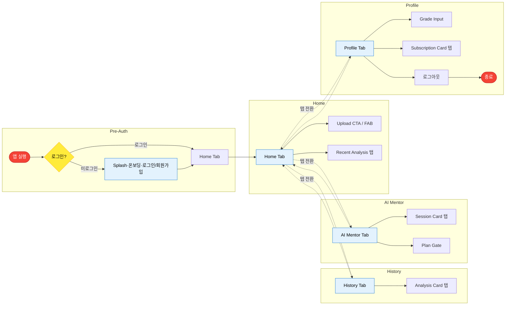

### 4.1b 공통 플로우 (Upload / Result / Chat / BS, 시간 순서)

Upload → Credit Confirm → Loading → Result Detail, Grade Input, Chat Room, Subscription. 결정=마름모(노랑), 입출력=평행사변형(초록), 진입/종료=빨강.

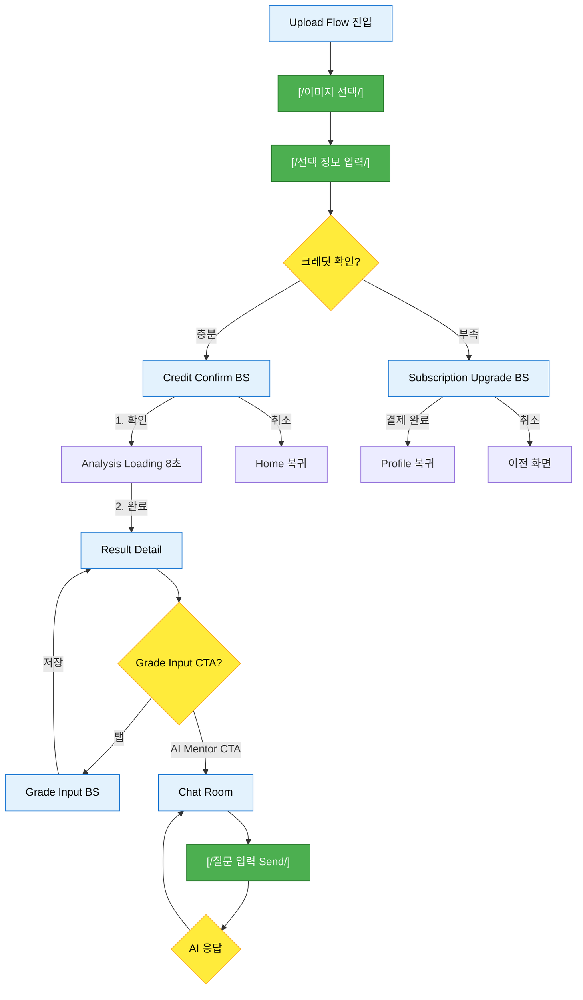

### 4.2 Decision Points & Modal Triggers

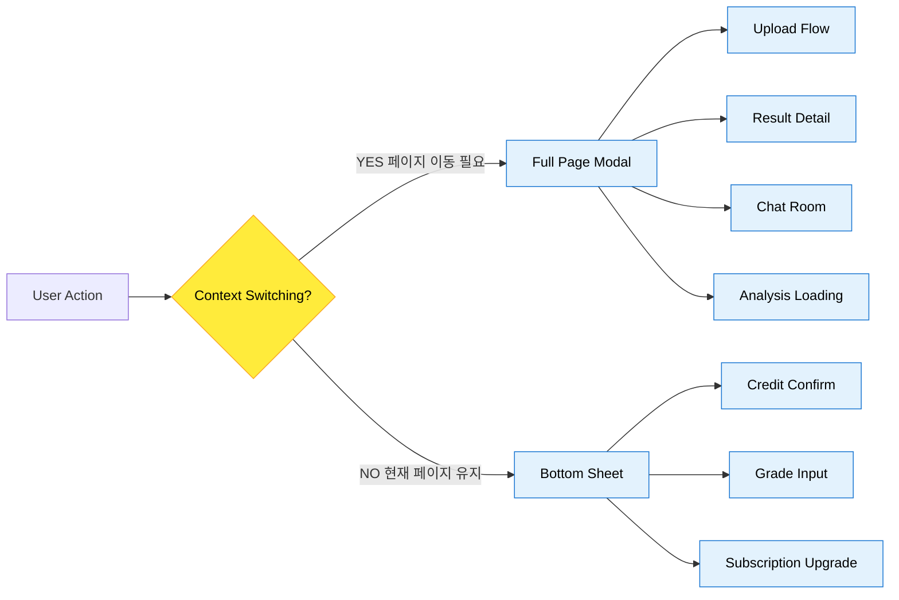

### 4.3 Pre-Auth Flow (유저/스크린)

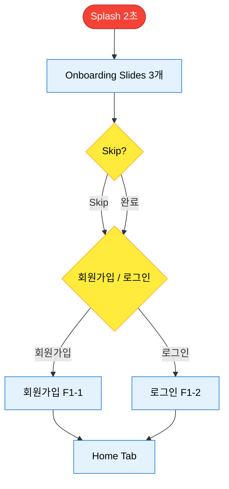


### 4.4 Home Flow (유저/스크린)

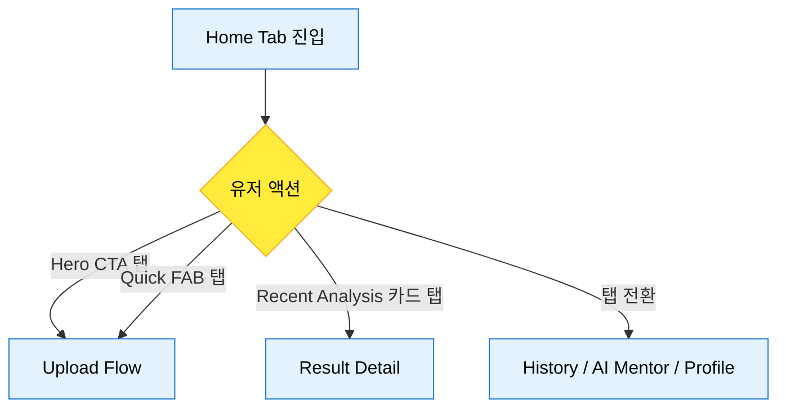

### 4.5 Upload Flow (유저/스크린)

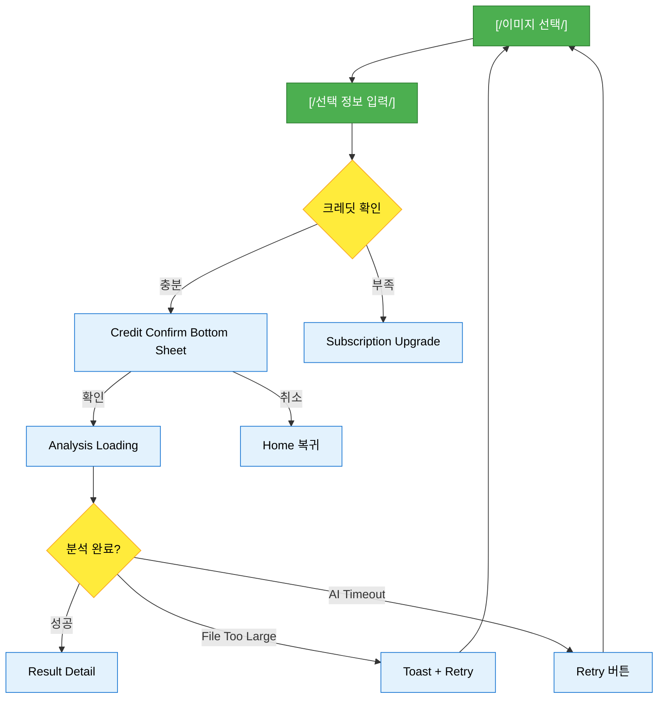

### 4.6 Result Detail Flow (유저/스크린)

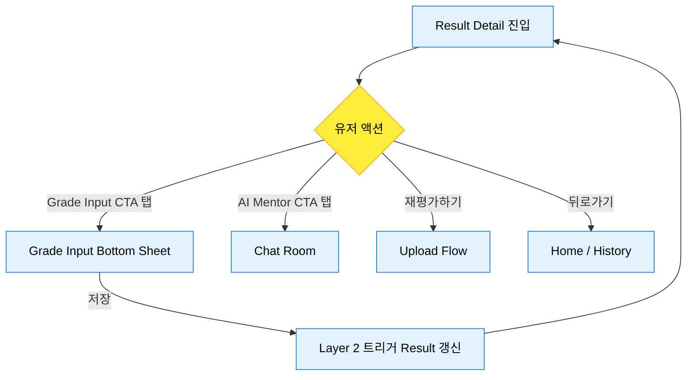

### 4.7 Chat Room Flow (유저/스크린)

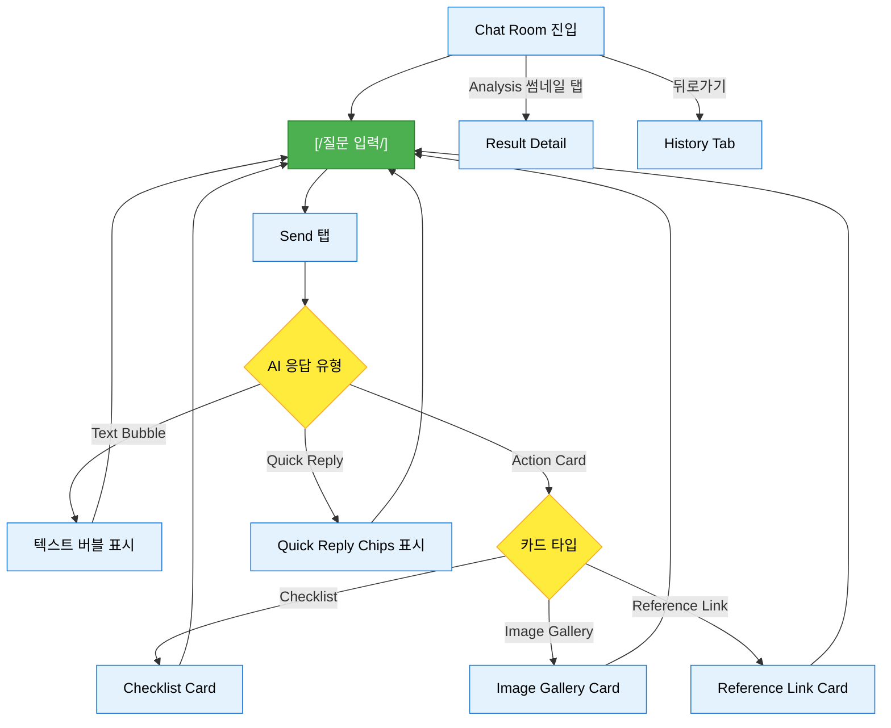

### 4.8 History Flow (유저/스크린)

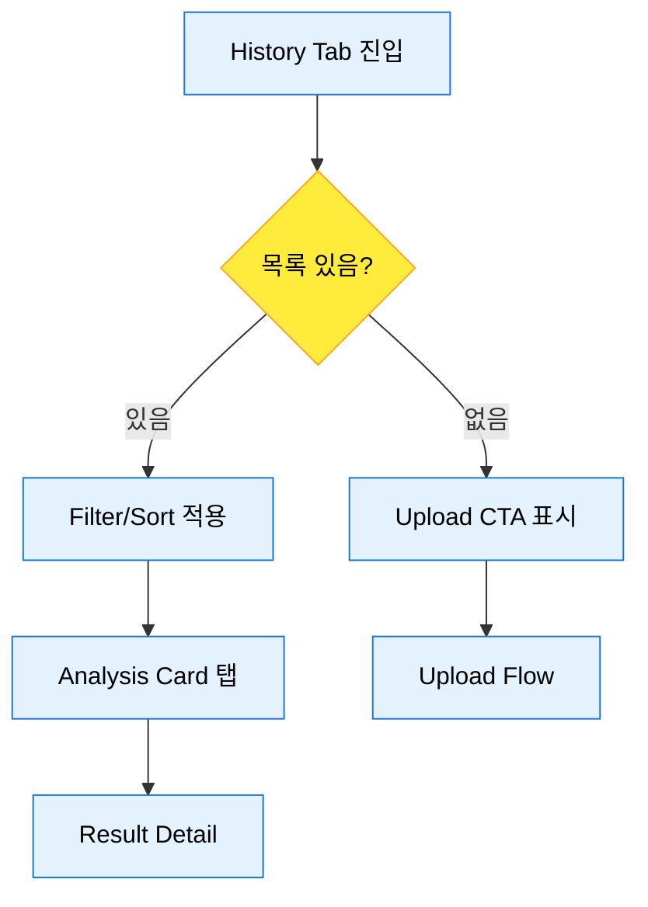

### 4.9 AI Mentor Flow (유저/스크린)

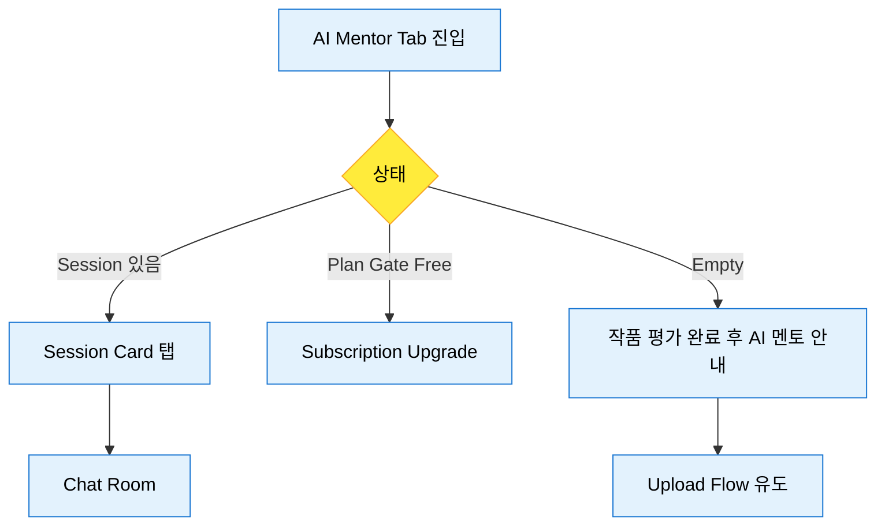

### 4.10 Profile Flow (유저/스크린)

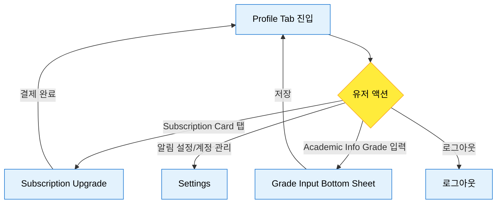

### 4.11 Magic Flow (태스크: 첫 평가 경험)

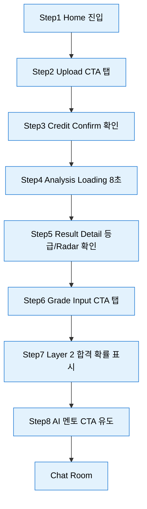

### 4.12 Coaching Flow (태스크: AI 멘토링)

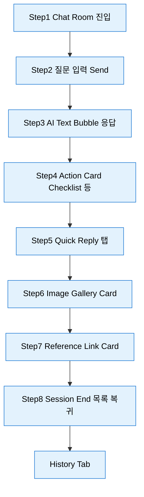

### 4.13 Grade Input Flow (태스크)

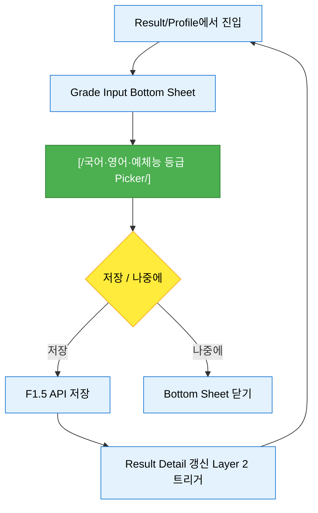

### 4.14 Subscription Flow (태스크)

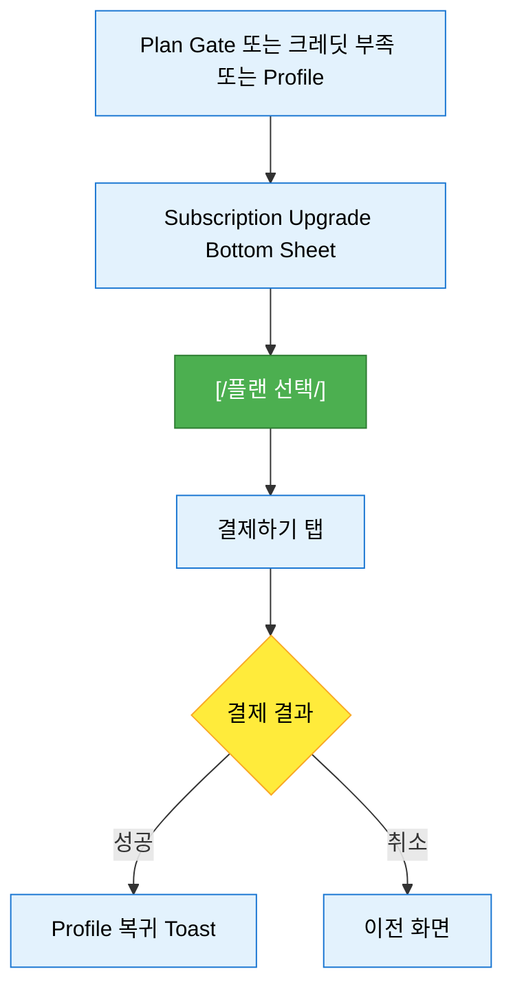

### 4.15 Error & Empty State Flow (태스크)

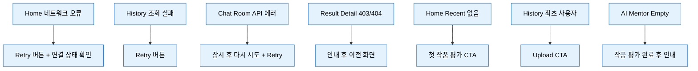

### 4.16 Integrated Specification Table (통합 명세 테이블)

| Flow ID | Screen | Function | ERD 필드 | API |
|---------|--------|----------|----------|-----|
| STEP_PreAuth_01 | Splash Screen | 앱 실행 진입 | - | - |
| STEP_PreAuth_02 | Onboarding Slides | Skip 또는 3개 슬라이드 확인 | - | - |
| STEP_PreAuth_03 | 회원가입 (F1-1) | 이메일·비밀번호·닉네임·학년·도메인 입력 | users.* | POST /api/auth/signup |
| STEP_PreAuth_04 | 로그인 (F1-2) | 이메일·비밀번호 입력 | users.email, password_hash | POST /api/auth/login |
| STEP_Upload_01 | Image Picker | 이미지 선택 (갤러리/카메라) | - | - |
| STEP_Upload_02 | Optional Info | Problem Text/Image/Time Limit 선택 입력 | analyses.problem_text 등 | - |
| STEP_Upload_03 | Credit Confirm | 1 크레딧 사용 확인 탭 | users.remaining_credits | - |
| STEP_Upload_04 | Analysis Loading | 8초 대기 후 자동 이동 | analyses.status | POST /api/analyses |
| STEP_Result_01 | Result Detail | 등급·Radar·fixScope 확인 | analyses.grade, scores, fix_scope | GET /api/analyses/{id} |
| STEP_Result_02 | Grade Input CTA | 성적 입력 Bottom Sheet 진입 | users.korean_grade 등 | PATCH /api/users/me/grades |
| STEP_Result_03 | Layer 2 | 합격 확률 University Predictions 표시 | analyses.university_predictions | GET /api/analyses/{id} |
| STEP_Chat_01 | Chat Room | 질문 입력 Send | chat_messages.content | POST /api/chat/{analysisId} |
| STEP_Chat_02 | AI Response | Text/Action Card/Quick Reply 수신 | chat_sessions, chat_messages | POST /api/chat/{analysisId} |
| STEP_Profile_01 | Profile | 구독·성적·설정 확인 | users.subscription_plan, remaining_credits, next_billing_date | GET /api/subscriptions/me |
| STEP_Subscription_01 | Subscription Upgrade | 플랜 선택·결제하기 | users.*, payments.* | POST /api/subscriptions/upgrade |

---

## 5. Design Principles & Constraints

### 5.1 Mobile-First Constraints

| 원칙 | 설명 | 구현 방법 |
|---|---|---|
| **Thumb Zone Design** | 모든 Primary CTA는 화면 하단 1/3에 배치 | Bottom Tab, FAB, Action Bar 고정 |
| **One-Handed Use** | 중요 인터랙션은 한 손 엄지로 조작 가능 | 오른쪽 하단 FAB, 하단 Input Bar |
| **Touch Target Size** | 최소 44×44pt (iOS), 48×48dp (Android) | 모든 버튼, 체크박스, 아이콘 준수 |

### 5.2 Zero Context Switching

| 시나리오 | ❌ 기존 방식 | ✅ dysprime 방식 |
|---|---|---|
| **성적 입력** | 별도 페이지 이동 → 입력 → 뒤로가기 | Result Detail 위 Bottom Sheet → 입력 → 자동 닫힘 |
| **크레딧 확인** | Alert 팝업 → 확인 → 별도 결제 페이지 | Credit Confirm Bottom Sheet → Upgrade Bottom Sheet (Stack) |
| **AI 응답 대기** | 빈 화면 + 로딩 스피너 | Typing Indicator + 기존 메시지 유지 |

### 5.3 Zero Dead-End

| 화면 | Next Action | Fallback |
|---|---|---|
| **Home** | Upload CTA, Recent Analysis | Quick FAB (항상 접근 가능) |
| **Result Detail** | AI Mentor CTA, 재평가하기 | Header 뒤로가기 → Home |
| **Chat Room** | 메시지 입력, Quick Reply | Analysis 썸네일 탭 → Result Detail |
| **History (Empty)** | "첫 작품 업로드하기" CTA | Bottom Tab → Home |

### 5.4 Terminology Alignment (BRD v4.0)

| FSD/ERD 용어 | UI 표기 | 사용자 인식 |
|---|---|---|
| **fixScope** | "구조 재설계 필요" / "디테일 개선 권장" | 우선순위 유형 |
| **Layer 1** | (백엔드 용어, UI 미노출) | "AI 평가 완료" |
| **Layer 2** | (백엔드 용어, UI 미노출) | "합격 확률 계산 완료" |
| **Layer 3** | "AI 멘토" | "1:1 코칭" |
| **universityPredictions** | "합격 가능 대학" | "입시 결과 예측" |

### 5.5 Visual Hierarchy (Academic Tech)

| 요소 | 색상 | 사용 시점 |
|---|---|---|
| **Primary CTA** | Vivid Lime (#84cc16) | Upload, Send, 결제하기 |
| **Background** | Deep Navy (#1e3a8a) | Header, AI Bubble, Bottom Tab |
| **Success** | Green (#22c55e) | A/B 등급, TOP Line |
| **Warning** | Amber (#f59e0b) | C/D 등급, MID Line, Bottom Sheet 배경 |
| **Error** | Red (#ef4444) | E/F 등급, LOW Line, 크레딧 부족 |

### 5.6 Empty State & Error State (전체 화면)

| 화면 | Empty State | Error State |
|------|-------------|-------------|
| **Home** | Recent Analysis 없음 → "첫 작품을 평가해보세요" CTA (기존) | 네트워크 오류 → Retry 버튼 + "연결 상태 확인" |
| **History** | (기존 정의) 최초 사용자 → Upload CTA | 조회 실패 → Retry 버튼 |
| **AI Mentor** | (기존) "작품 평가 완료 후 AI 멘토를 만나보세요" | - |
| **Chat Room** | 세션 진입 시 "질문을 입력해보세요" | API 에러 → "잠시 후 다시 시도해주세요" + Retry |
| **Result Detail** | 분석 미완료 → Loading (기존) | 권한 없음 F6 E1 (기존), 레코드 없음 404 → 안내 후 이전 화면 |

**전역 에러 처리 원칙**: API 5xx/네트워크 오류 시 자동 3회 재시도 후, 실패 시 사용자에게 Retry 버튼 제공. 토스트 또는 인라인 안내로 원인 간단 표시.

### 5.7 Accessibility (a11y)

| 요소 | Screen Reader Label | 비고 |
|------|---------------------|------|
| Hero CTA | "첫 작품 평가하기" | 버튼 목적 명시 |
| Grade Badge | "등급 {A~F}" | 등급 값 읽기 |
| Quick FAB | "업로드 빠른 메뉴" | FAB 용도 |
| Radar Chart | "5개 지표 레이더 차트" | 요약 후 터치 시 개별 지표 |

**Color Contrast**: WCAG AA 준수 (본문·CTA 대비 4.5:1 이상). Touch Target은 기존 §5 유지(최소 44×44pt).

### 5.8 Loading States

| 화면/영역 | Skeleton 대상 | 비고 |
|-----------|---------------|------|
| Home | Recent Analysis 3카드 | 피드 로딩 시 |
| History | Analysis Card 10개 | 초기 20개, Infinite Scroll 추가 20개 |
| Result Detail | 전체 레이아웃 | 분석 조회 중 |
| Chat Room | 메시지 리스트 | 세션/메시지 로딩 시 |

---

## 6. Development Handoff Checklist

### 6.1 Component Library (우선순위)

| Component | Status | Figma Link | Dev Notes |
|---|---|---|---|
| Bottom Tab Navigation | 🟢 Ready | - | 4개 탭, Active State (Lime Underline) |
| Hero Upload CTA | 🟢 Ready | - | Lime 배경, Deep Navy 텍스트 |
| Grade Badge | 🟢 Ready | - | A~F, Circular Badge, 글자 크기 32pt |
| Radar Chart | 🟡 In Progress | - | Chart.js 또는 Recharts 사용 |
| Action Card Widget | 🔴 To-Do | - | Checklist, Image Gallery, Link 3종 |
| Bottom Sheet | 🟢 Ready | - | iOS Sheet, Android BottomSheetDialog |

### 6.2 API Endpoints (FSD 매핑)

| API | Method | Endpoint | Component | Screen |
|---|---|---|---|---|
| F1-1 | POST | `/api/auth/signup` | 회원가입 화면 | Pre-Auth |
| F1-2 | POST | `/api/auth/login` | 로그인 화면 | Pre-Auth |
| F1.5 | PATCH | `/api/users/me/grades` 또는 `/api/profile/grades` | Grade Input Bottom Sheet | Result Detail / Profile |
| F2 Upload | POST | `/api/analyses` | Upload Flow | Image Picker → Loading |
| F6 | GET | `/api/analyses/{analysisId}` | Result Detail 단건 조회 | Result Detail |
| F5 Chat | POST | `/api/chat/{analysisId}` | Chat Room | Message List |
| F7-1 | POST | `/api/subscriptions/upgrade` | Subscription Upgrade 결제하기 | Subscription Upgrade Bottom Sheet |
| F7-2 Subscription | GET | `/api/subscriptions/me` | Profile | Credit Status Widget |

### 6.3 Animation Specs

| Animation | Duration | Easing | Trigger |
|---|---|---|---|
| Bottom Sheet Slide-Up | 300ms | ease-out | Grade Input, Subscription Upgrade |
| Page Transition | 250ms | cubic-bezier(0.4, 0, 0.2, 1) | Tab Switch, Result Detail |
| Lottie Loading | 8000ms (loop) | - | Analysis Loading |
| Typing Indicator | 1500ms (loop) | - | Chat Room (AI 응답 대기) |

---

## 문서 변경 이력

| Version | Date | Author | Changes |
|---|---|---|---|
| 1.0 | 2026-02-06 | - | FSD v1.3 & ERD v1.1 기반 초안 작성 (4개 섹션, Mermaid 2개) |
| 1.1 | 2026-02-07 | - | 정합성 검증 보고서 반영: Pre-Auth 플로우, §6.2 API 보강(F1/F1.5/F6/F7-1), Action Card 저장 문구 ERD 정합, F6 E1 에러·next_billing_date 표기 |
| 1.2 | 2026-02-07 | - | 추가 디벨롭 반영: Onboarding(Splash·Slides·First Upload 가이드), §5.6 Error/Empty State 전체 화면 명세, §5.7 Accessibility, §5.8 Loading States |
| 1.3 | 2026-02-07 | - | 플로우 차트 Mermaid 전면 정리: §4.0 갭 목록, §4.1 Global Flow(style 제거), §4.3~4.15 탭별·태스크별 플로우, §4.16 통합 명세 테이블 |
| 1.4 | 2026-02-07 | - | 전역 플로우 그리드·색상·흐름 개선: §4.0 그리드 해석·노드/색상 규칙·흐름 문단, §4.1a 탭 그리드(컬럼=탭), §4.1b 공통 플로우, §4.3~4.15 classDef(진입/종료=빨강, 결정=노랑, 입출력=초록) |

---

*© 2026 dysprime. All rights reserved.*
